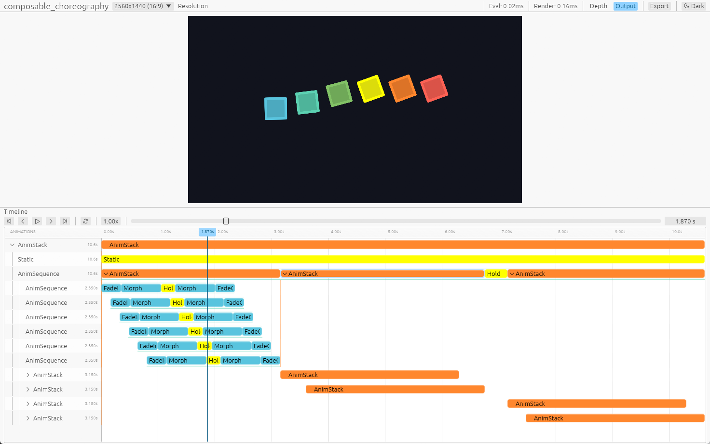

# v0.3

本文是 v0.3 动画系统的设计记录。其中编排系统与渲染侧的 ECS 化沿用了各自 PR 的设计；求值协议一节按当前实现（content-is-sequence 收敛后的版本）编写。

## 新增

- 可组合动画编排系统（见 "Composable Animation Arrangement" 一节）
  - `AnimSequence`/`AnimStack` 容器与 `seq!`/`stack!` 宏，`hold`/`forward`/`extend` 等编排 API
  - `AnimLagged` 容器（stagger 排布 + 窗口外静态填充）与 `lagged!` 宏、迭代器容器收集（`collect::<AnimStack>()`/`collect::<AnimSequence>()`、`into_stack`/`into_seq`/`into_lagged`）
  - 播放参数 `Paramed<A>`（`with_duration`/`with_rate_func`/`with_enabled`）与放置 `At<A>`
- 求值协议与适配器（见"求值与迭代式动画区段"一节）
  - 单一 `Eval` 协议：`eval_alpha(&self, alpha)` 是叶子动画唯一的求值入口
  - 进度是唯一坐标：`Time`/`DeltaTime` 结构已删除，`ranim_core::time` 只保留 `Alpha`/`DeltaAlpha` 两个类型别名
  - 纯/迭代特化位于 *ranim-core*：`Pure` 包装闭式闭包，`Iterative` 包装 `IterativeEval` step 逻辑；闭包经 `Pure::new(|alpha| ...)` / `Iterative::from_fn(state, step_fn)` 成为动画
  - `SceneEvaluator::sample_at` 是唯一 session 交互，seek/重放由 stateful 节点内部完成

## BREAKING CHANGES

- 动画组织系统
  - 弃用 `Timeline`（迁移到 `AnimSequence`/`AnimStack`）
  - `AnimationCell<T>` 的泛型参数移除、不再直接构建（`Eval` 类型可直接作为动画使用）；原先 `AnimationCell<T>` 的 `AnimationInfo` 参数改为 `Paramed<A>` 和 `At<A>`
  - *ranim-anims* 中全部内置动画创建工具方法现在默认用 `linear` 速率函数和 `1.0` 持续秒数
- 求值与内置动画 API
  - `Eval<T>` 泛型参数改为关联类型，方法集收敛为单一 `eval_alpha(&self, alpha)`（见"求值与迭代式动画区段"一节）；`sample`/`reset`/`step` 与 `PureEval` 已删除
  - `Time`/`DeltaTime` 结构已删除；`Eval::eval_alpha` 收 `f64`，`IterativeEval::step` 收 `alpha`/`delta_alpha`
  - 内置动画工具方法直接返回具名动画类型（如 `fade_in()` 返回 `FadeIn<T>`），这些类型直接实现 `Eval`
  - `Pure` 与 `Iterative` 从 *ranim-anims* 移入 *ranim-core* 的 `animation::eval::{pure, iterative}`
  - `CameraFrame::orbit` 移到 *ranim-anims* 的 `CameraFrameAnim`
  - 删除 *ranim-anims* 的 `Lagged` 求值器与 `lagged` 模块（`LaggedAnim` 糖），stagger 排布改用 `AnimLagged` 容器

## Composable Animation Arrangement

https://github.com/AzurIce/ranim/pull/170

### `AnimSequence` 和 `AnimStack`

Ranim 动画编排的本质是构造动画数据表示并放入集合，在之前的设计中整个 `RanimScene` 通过内部的 `Vec<Timeline>` 来维护动画。

`Timeline` 的本质是 `Vec<Box<dyn CoreItemAnimation>>` 动画序列容器，其中的每个元素都是前后相继的动画表示，同一时间一个 `Timeline` 只有一个动画激活，于是以前在动画组合代数上非常局限：
- 串行的动画必须通过 `Timeline` 的 API 手动推进/同步时间到对应位置
- 并行的动画必须通过创建新的 `Timeline` 来实现
- 整个场景的 `Vec<Timeline>` 本质是一次性并行组合多个串行编排的性质

在 Ranim v0.3 中，原本的 `Timeline` 被弃用，新增了两个可组合的基本动画容器 `AnimSequence` 和 `AnimStack`。

比如对于如下的动画：

- 正方形：0.0s ~ 1.0s 淡入 | 1.0s ~ 2.0s 变成圆形 | 2.0s ~ 3.0s 淡出
- 文字：0.5s ~ 1.5s 写入 | 1.5s ~ 2.5s 擦除

在以前的 Timeline API 下要这样编写：

```rust
let r_vitem = r.insert_with(|t| {
    t.play(item.fade_in())
        .play(item.morph_to(VItem::from(Circle::default())))
        .play(item.fade_out())
});
let r_text = r.insert_with(|t| {
    t.forward(0.5)
        .play(text.write())
        .play(text.unwrite())
});
```

而使用 `AnimSequence` 和 `AnimStack` 可以这样：

```rust
let anim = stack![
    seq![
        item.fade_in(),
        item.morph_to(VItem::from(Circle::default())),
        item.fade_out(),
    ],
    seq![
        text.write(),
        text.unwrite()
    ].at(0.5)
];
r.play(anim);
```

其中的 `seq!` 和 `stack!`（类似 `vec!`），会构造 `AnimSequence` 和 `AnimStack` 并将动画插入其中（类似 `Vec`）。

如果要把这段动画播放两遍，原来的 Timeline API 会非常繁琐，或许需要将相关时间线操作封装为闭包，而对于新的可组合 API 很简单：

```rust
r.play(seq![anim.clone(), anim]);
```

更能够表现新系统的可组合与复用能力的例子见 `composable_choreaography` example。

### `AnimationCell`、`Eval` 与 `Animation` Trait

`Eval<T>` 的泛型参数被移除并改成了关联类型（一个求值器类型的求值结果类型是唯一的）。

以前 `AnimationCell<T>` 被当作动画的组织单元，所有动画必须被表示为 `AnimationCell<T>` 才能够被插入时间线。现在这个行为被抽象为了一个 `Animation` Trait：

```rust
/// A statically typed animation definition that can be lowered into a runtime animation.
pub trait Animation: Sized {
    /// Lower this definition into its local runtime representation.
    fn build(self) -> AnimationCell;
}
```

同时泛型参数被从 `AnimationCell` 移除，其内部变成类型擦除的 `Box<dyn EvalDyn>`。

所有的 `E: Eval where E::Output: AnyExtractCoreItem` 都自动实现了 `Animation`，于是所有的动画创建都不必返回 `AnimationCell`，可以直接返回自己就可以使用。

```rust
// previous
impl<T: FadingRequirement + Sized + 'static> FadingAnim for T {
    fn fade_in(&mut self) -> AnimationCell<Self> {
        FadeIn::new(self.clone())
            .into_animation_cell()
            .with_rate_func(smooth)
            .apply_to(self)
    }
    fn fade_out(&mut self) -> AnimationCell<Self> {
        FadeOut::new(self.clone())
            .into_animation_cell()
            .with_rate_func(smooth)
            .apply_to(self)
    }
}
```

```rust
impl<T: FadingRequirement + Sized + 'static> FadingAnim for T {
    fn fade_in(&mut self) -> FadeIn<Self> {
        FadeIn::new(self.clone()).apply_to(self)
    }
    fn fade_out(&mut self) -> FadeOut<Self> {
        FadeOut::new(self.clone()).apply_to(self)
    }
}
```

`Animation` Trait 也是可组合动画的核心，`AnimSequence`、`AnimStack`、`Paramed<A>` 和 `At<A>` 也实现了该 Trait，可以当作一个动画使用。

### `AnimLagged` 与迭代器收集

stagger 排布由 `AnimLagged` 容器表达：

```rust
let animation = lagged![0.2; a.fade_in(), b.fade_in(), c.write()];
```

- 子动画要求 `Placeable`（和 `AnimSequence` 一样），放置由容器计算：`start_i = start_{i-1} + lag_ratio · d_{i-1}`。`lag_ratio` 因此是 `AnimStack`（0.0，同时）与 `AnimSequence`（1.0，相继）之间的插值；
- 窗口外时间由 `with_leading`/`with_trailing` 配置（`LaggedFill::{Hold, Empty}`，默认都 `Hold`）：每个元素在 build 时被物化为一条 `[前填充][动画][后填充]` 的 per-item `AnimSequence` 轨道（前=初态、后=末态，采样自窗口边缘；空填充跳过；零时长子项跳过前填充）——preview 时间线所见即所得，没有隐藏的钳制规则。想让元素窗口后消失，让它的动画以 `hide` 结尾（`seq![item.fade_in(), item.hide()]`）；
- 由于填充在 build 时采样，子动画应当是纯（闭式）动画；
- 子动画是完整的 `Animation`：可以自带 `with_rate_func`/`with_duration` 等播放参数，容器在各自 cell 上施加速率；
- 配套迭代器 API：`collect::<AnimStack>()`/`collect::<AnimSequence>()`（`FromIterator`）与 `AnimIterExt::{into_stack, into_seq, into_lagged}`。

### `Paramed<A>`、`At<A>`

动画本身在时间轴上“长什么样子”并不依赖于其起始时间，只有在要 **放置** 在某种时间坐标上的时候起始时间才存在作用。对于 `AnimSequence` 和 `AnimStack` 来说，前者反而要求动画没有被指定起始时间，因为动画要被相继紧接着放置进序列中。

原先统一在 `AnimationInfo` 内的动画参数现在拆分到了 `Paramed<A>` 和 `At<A>` 两个泛型结构体内：

```rust
/// An animation definition with overridden playback parameters.
pub struct Paramed<A> {
    inner: A,
    param: AnimationParam,
}

/// An animation fixed at an offset in its parent's time coordinates.
///
/// This is a terminal placement entry: it implements [`Animation`] but not
/// [`Placeable`], so playback parameters must be configured before calling
/// [`Placeable::at`].
pub struct At<A> {
    inner: A,
    offset_sec: f64,
}
```

使用 `.with_duration`、`with_rate_func`、`with_enabled` 会自动修改或包裹 `Paramed<A>`，使用 `.at` 会自动包裹 `At<A>`。

## Preview App 时间轴控件重构

在新的动画组织系统下，Preview App 的时间轴控件也对应做了大幅重构：



## ECS Schedule 取代 RenderGraph

https://github.com/AzurIce/ranim/pull/175

渲染侧的 ECS 化：渲染原语进入内部 `RenderWorld`，渲染准备与 GPU pass 由 schedule 组织；用户级 item、动画求值仍停留在 World 之外。

### 之前：`CoreItemStore` 兼任传输与查询

旧实现里，求值结果由 `CoreItemStore` 承载：

```rust
/// A store of [`CoreItem`]s.
#[derive(Default, Clone)]
pub struct CoreItemStore {
    /// Id of [`CameraFrame`]s
    pub camera_frame_ids: Vec<(usize, usize)>,
    /// [`CameraFrame`]s
    pub camera_frames: Vec<CameraFrame>,

    /// Id of [`VItem`]s
    pub vitem_ids: Vec<(usize, usize)>,
    /// [`VItem`]s
    pub vitems: Vec<VItem>,

    /// Id of [`MeshItem`]s
    pub mesh_item_ids: Vec<(usize, usize)>,
    /// [`MeshItem`]s
    pub mesh_items: Vec<MeshItem>,
}
```

它既用于承载并传输求值结果，又用于渲染管线查询访问——两种职责混在一起。

### 现在：`RenderFrame` 传输 + `RenderWorld` 查询

拆分为了 `RenderFrame`（帧级传输缓冲）和 `Renderer` 内部的 ECS World：

```rust
/// A reusable, frame-local transport buffer between evaluation and rendering.
#[derive(Default)]
pub struct RenderFrame {
    items: Vec<(CoreItemId, CoreItem)>,
}
```

```rust
pub struct Renderer {
    width: u32,
    height: u32,
    world: World,
}
```

前者只用于传输（求值线程 → 渲染线程），后者用于承载运行时的查询、变更检测与 schedule。

### Reconcile：按身份增量更新实体

每帧从 `RenderFrame` 更新 `World`，再运行渲染 Schedule：

```rust
/// Reconcile and render one evaluated frame.
pub fn render_frame(
    &mut self,
    render_textures: &mut RenderTextures,
    clear_color: wgpu::Color,
    frame: &RenderFrame,
) {
    reconcile(&mut self.world, frame);
    self.world
        .insert_resource(FrameTarget::new(render_textures, clear_color));
    self.world.run_schedule(RenderPrepare);
    self.world.run_schedule(RenderGraph);
}
```

reconcile 以 `CoreItemIdentity(animation_id, part)` 为跨帧 key，从 `RenderFrame` 更新渲染 `World`：

- 每个实体携带 `CoreItemIdentity` 与 `SceneOrder`；值相同则不写组件（保留 `Changed<T>`），值变化才替换，本帧消失的 key 对应实体被移除；
- **身份与顺序是两件事**：`CoreItemIdentity` 回答"是否是上一帧的同一项"，`SceneOrder` 回答"本帧按什么顺序消费"——ECS query 顺序不构成绘制顺序，prepare 阶段显式按 `SceneOrder` 排序分桶；

### Schedule 组织渲染阶段

```text
RenderPrepare:  Collect → PrepareResources → Upload → PrepareBindGroups
RenderGraph:    Begin → Render → Submit → Finish
  └─ ViewRender: Clear → Compute → Depth → Color → OITResolve
```

- `RenderPrepare` 把组件展开为 GPU 输入（storage/index/uniform 数据、上传、绑定组）；
- `RenderGraph` 驱动整个画面生命周期：`Begin` 创建 frame encoder，`Render` 运行逐 view 子 schedule，`Submit` 提交 command buffer，`Finish` 结束 profiling frame；
- 单相机也走完整的 `ViewRender` 子 schedule（clear、VItem compute、depth、color、OIT resolve），避免单 view 成为以后多 view 的特殊路径；
- 自制的 `Graph<NodeKey, Box<dyn RenderNode>>` 节点图被移除——节点 trait、拓扑容器和查询都在重复 ECS schedule 已提供的能力。

## 求值与迭代式动画区段

相关 PR：#177（有状态区段引入）、#183（统一协议与容器重组）。本节按当前 content-is-sequence 收敛后的实现编写。

v0.2 的动画区段都是**函数式**的：从归一化进度闭式采样。这类区段无法表达**有状态的迭代式动画**（粒子、弹簧、物理模拟、三体），因为求值器无法保留跨帧状态、也无法按 `dt` 推进。v0.3 用一套通用求值协议统一两类区段，并最终把协议收敛为对进度的纯查询。

### 单一 `Eval` 协议

纯（闭式）与迭代（有状态）区段底层是同一个协议。动画内容一旦定义就不可变，evaluator 只回答一个问题：在自身归一化进度 `alpha ∈ [0, 1]` 处的输出是什么。

```rust
pub trait Eval {
    type Output;

    /// 在归一化进度 alpha 处求值。
    fn eval_alpha(&self, alpha: f64) -> Self::Output;
}
```

- `eval_alpha` 是 `&self` 上的纯查询：同一个 `alpha` 永远得到同一个 `Output`，与调用顺序和次数无关；
- evaluator 看不到秒、场景时钟或 `logic_fps`；`AnimationCell` 负责把场景时间映射成 `alpha` 后再调用它；
- 有状态区段在内部记忆化自己的积分快照；纯区段就是闭式函数。

`EvalExt::apply_to` / `apply_alpha_to` 是 build 期便捷方法：它们通过 `eval_alpha` 把 item 写成指定进度（默认末态）并返回动画本身。内置动画的工具方法（`fade_in()` 等）正是靠 `apply_to` 在创建动画的同时把 item 置为末态。

### 纯闭包：`Pure`

闭包是匿名类型，不能按名字实现 `Eval`，所以用 `ranim_core::animation::eval::pure::Pure` 包一层：

```rust
pub struct Pure<F>(pub F);

impl<T, F> Eval for Pure<F>
where
    F: Fn(f64) -> T,
{
    type Output = T;

    fn eval_alpha(&self, alpha: f64) -> T {
        (self.0)(alpha)
    }
}
```

```rust
let animation = Pure::new(|alpha| Square::new(alpha)).with_duration(2.0);
```

具名纯动画（`FadeIn`、`Morph`、`Create` 等）直接实现 `Eval`，不需要这个 wrapper。

### 迭代区段：`IterativeEval` + `Iterative`

```rust
pub trait IterativeEval {
    type Output;

    /// 推进一个内容步。alpha 是当前进度，delta_alpha = 1/N。
    fn step(&self, output: &mut Self::Output, alpha: f64, delta_alpha: f64);
}
```

`Iterative::new(initial, evaluator)` 持有不可变的定义（初始状态、`sim_step`、step 逻辑），把积分快照放在内部 `RefCell<Snapshot>` 中。`with_steps(N)` 声明内容自己的步数（默认 `1/120`）；`eval_alpha(target)` 前进时逐 `sim_step` 积分，回退时从初始状态重置重放，重复查询同一个 `alpha` 是 O(1)。

迭代逻辑本身简单时，直接用 `Iterative::from_fn` 写闭包即可；逻辑时长使用**过程中的局部变量**捕获，并传给 `with_duration`，不要使用全局 `const`：

```rust
let sim_secs = 4.0;

let animation = Iterative::from_fn(
    SpringState { x: 1.0, v: 0.0 },
    move |state, _alpha, delta_alpha| {
        let dt = sim_secs * delta_alpha; // 内容自己的物理秒
        let acc = -K * state.x - C * state.v;
        state.v += acc * dt;
        state.x += state.v * dt;
    },
)
.with_steps(240)
.with_duration(sim_secs);
```

- 闭包的状态类型位于 `Fn` 输入位置，stable Rust 无法从闭包类型反推出关联 `Output`，所以 `Iterative::from_fn` 通过 `IterativeFn<S, F>` 显式绑定二者；
- 迭代逻辑较复杂、需要多个字段或复用方法时，实现命名 `IterativeEval` 结构体，并把 `sim_secs` 等参数放在 `self` 上；
- 可变状态全部住在 `Output` 里，适配器持有初始状态值，恢复是结构性的；
- 状态与渲染内容不同时，为状态类型实现 `Extract`（每帧投影一次），如 `nbody` 的 bodies+trails → `VItem`。

### 进度是唯一坐标

`Time` / `DeltaTime` / `GlobalTime` 已从协议中删除。`ranim_core::time` 只保留两个类型别名：

```rust
pub type Alpha = f64;       // 归一化进度
pub type DeltaAlpha = f64;  // 均匀进度步长
```

- **动画逻辑只见进度、不见时间配置**：起点、时长、rate 都属于 `AnimationCell`，由它把场景时间映射成 `alpha`；
- “内容即序列”：迭代动画的内容是作者声明的进度点序列 `x₀…x_N`，`N` 是定义而不是采样精度；
- `with_duration` / `with_rate_func` / placement 是纯播放重映射（哪个进度何时可见），不改变内容本身；
- 需要真实时间的现象（如 cloth 中球的运动）使用内容自己的逻辑时长换算：`sec = sim_secs * alpha`，而不是读全局时钟。

### `SceneEvaluator`：单入口会话驱动

```rust
pub type EvaluatedFrame = Vec<((usize, usize), CoreItem)>;

impl SceneEvaluator {
    /// 对当前 render 时刻采样，输出 (animation_id, item) 流。
    pub fn sample_at(&mut self, render_secs: f64, out: &mut EvaluatedFrame);
}
```

- `sample_at` 是唯一的 session 交互：渲染、preview 拖拽共用这条路径；
- 前进 / 回退 / 原地求值由 `Iterative` 等 stateful 节点内部完成，session 不再维护逻辑网格；
- 步进尺度由每个迭代区段自己的 `sim_step` 决定（早期的 `logic_fps` 参数已删除）。

### 模块布局

```text
ranim_core::animation
├── eval
│   ├── pure       （Pure）
│   └── iterative  （IterativeEval / Iterative / IterativeFn）
├── sequence       （AnimSequence）
├── stack          （AnimStack）
└── lagged         （AnimLagged）

ranim::anims
├── camera         （Orbit、CameraFrameAnim）
├── creation       （Create/UnCreate/Write/Unwrite）
├── fading         （FadeIn/FadeOut）
├── morph          （Morph）
└── rotating       （RotatingAnimation）
```

### 示例

- `iterative_spring`：阻尼弹簧，简单闭包步进，`sim_secs` 为过程局部变量；
- `nbody`：N 体引力模拟（velocity Verlet、混沌弹射终场、无边界），同样是局部 `sim_secs` + 闭包；
- `cloth_wrap`：零重力布料（弹簧力 + 自碰撞 + 球-布碰撞，MeshItem 曲面渲染；球的 kinematic 状态由 `sim_secs * alpha` 驱动，`Extract` 投影）。
