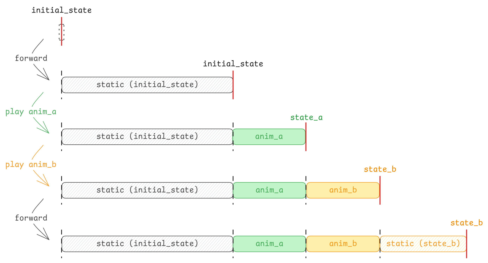

# Getting Started

<div class="warning">

注意：

当前本章内容非常不完善，结构不清晰、内容不完整，目前建议结合 Example 和源码来了解。

</div>

在 Ranim 中，定义并渲染一段动画的代码基本长成下面这个样子：

```rust
use ranim::prelude::*;

{{#include ../../examples/hello_ranim/main.rs:18:19}}
        // ...
    }
}

fn main() {
    render_scene_output(
        hello_ranim,
        "hello_ranim".to_string(),
        &SceneConfig::default(),
        &Output::default()
    );
}
```

`render_scene` 函数接收一个 `impl SceneConstructor` 并使用它对动画进行构造、求值、渲染，并将渲染结果按照传入的 `Output` 定义输出为视频。

默认的输出路径为 `./output/<scene_name>_<width>x<height>_<fps>.mp4`。

此外，当启用了 `app` feature 时，可以使用 `run_scene_app` 来启动一个能够可视化时间线并拖动进度条预览画面的应用：

```rust,ignore
run_scene_app(hello_ranim, "hello_ranim".to_string());
```

## 1. 场景的构造

任何实现了 `SceneConstructor` Trait 的类型都可以被用于构造场景：

```rust,ignore
{{#include ../../src/lib.rs:SceneConstructor}}
```

*ranim* 自动为 `F:  Fn(&mut RanimScene) + Send + Sync` 实现了该 Trait。

也就是说，对于要求 `impl SceneConstructor` 的参数：
- 既可以传入函数指针 `fn(&mut RanimScene)`
- 也可以传入一个闭包 `|r: &mut RanimScene| { /*...*/ }`。

整个构造过程围绕着 `&mut RanimScene`，它是 ranim 中编码动画 api 的主入口。

## 2. 时间线

每一个被插入时间线的物件都有一个唯一的 `ItemId`，同时也有一条对应的时间线。

时间线是一种用于编码物件动画的结构，它的内部有一个存储了动画以及展示时间的列表，以及用于编码静态动画的物件状态。

编码动画的过程本质上是在向时间线中插入动态或静态的动画：



### 2.1 插入物件（创建时间线）

通过 `r.insert(state)` 可以插入一个物件并为其创建一条时间线：

```rust,ignore
let square = Square::new(2.0).with(|x| {
    x.set_color(manim::BLUE_C);
});
let circle = Circle::new(1.0).with(|x| {
    x.set_color(manim::RED_C);
});

let r_square1 = r.insert(square.clone()); // 类型为 `ItemId<Square>`
let r_square2 = r.insert(square); // 类型为 `ItemId<Square>`
let r_circle = r.insert(circle); // 类型为 `ItemId<Circle>`
```

### 2.1 访问时间线

时间线在被创建之后，需要通过 `r.timeline(&index)` 或 `r.timeline_mut(&index)` 来访问：

```rust,ignore
{
    // 类型为 `&ItemTimeline<Square>`
    let square_timeline_ref = r.timeline(&r_square1);
}
{
    // 类型为 `&ItemTimeline<Circle>`
    let circle_timeline_ref = r.timeline(&r_circle);
}
```

除了通过单一的 `&ItemId` 来访问单一的时间线，也可以通过 `&[&ItemId<T>; N]` 来访问多条时间线：

```rust,ignore
// 类型为 `[&mut ItemTimeline<Square>]`
let [sq1_timeline_ref, sq2_timeline_ref] = r.timeline_ref(&[&r_square1, &r_square2]);
```

同时也可以访问全部时间线的切片的不可变/可变引用，不过元素是类型擦除后的 `ItemDynTimelines`：

```rust,ignore
// 类型为 &[ItemDynTimelines]
let timelines = r.timelines();
// 类型为 &mut [ItemDynTimelines]
let timelines = r.timelines_mut();
```

### 2.2 操作时间线

`ItemTimeline<T>` 和 `ItemDynTimelines` 都具有一些用于编码动画的操作方法：

| 方法                     | `ItemTimeline<T>` | `ItemDynTimelines` | 描述                    |
| ------------------------ | ----------------- | ------------------ | ----------------------- |
| `show` / `hide`          | ✅                | ✅                 | 显示/隐藏时间线中的物体 |
| `forward` / `forward_to` | ✅                | ✅                 | 推进时间线              |
| `play` / `play_with`     | ✅                | ❌                 | 向时间线中插入动画      |
| `update` / `update_with` | ✅                | ❌                 | 更新时间线中物体状态    |
| `state`                  | ✅                | ❌                 | 获取时间线中物体状态    |

有关方法的具体详细定义可以参考 API 文档。

下面的例子使用一个 `Square` 物件创建了一个时间线，然后编码了淡入 1 秒、显示 0.5 秒、消失 0.5 秒、显示 0.5 秒、淡出 1 秒的动画：

```rust,ignore
{{#rustdoc_include ../../examples/getting_started0/main.rs:construct}}
```

### 2.3 转换时间线类型

在对一个物件进行动画编码的过程中有时会涉及物件类型的转换，比如一个 `Square` 物件需要被转换为更低级的 `VItem` 才能够被应用 Write 和 UnWrite 动画，
此时就需要对时间线类型进行转换：

```rust,ignore
{{#rustdoc_include ../../examples/getting_started1/main.rs:construct}}
```
