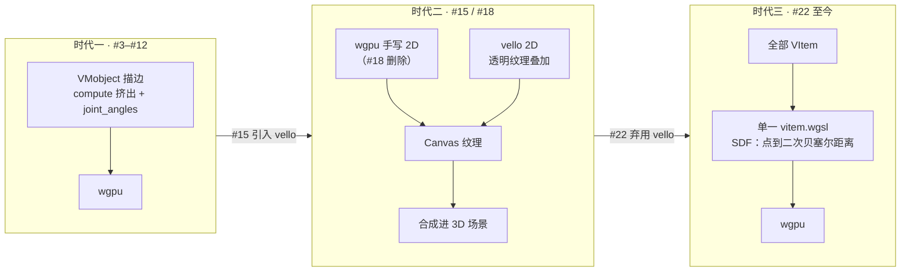
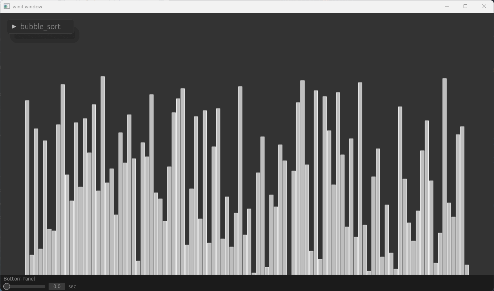
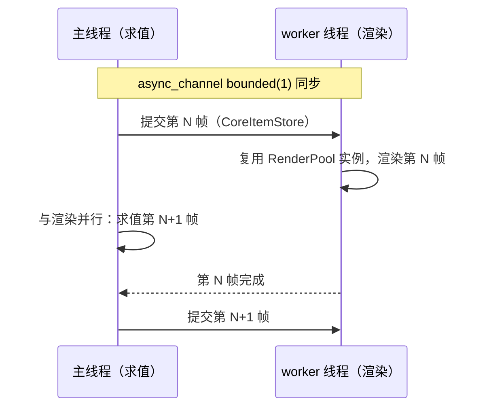

# v0.1

> **Status: Backfilled（补写）** — 覆盖 #3–#96；按 v0.1.5（2025-10-18）发布时点快照描述。
> 起源期 PR（#3–#28，2024-11 → 2025-03）先于首个 tag `v0.1.0-alpha.1` 落地；`alpha.8`/`alpha.10`/`alpha.15`/`alpha.16` 从未发布，`v0.1.1`–`v0.1.3` 只含未经 PR 的直接修复。

v0.1 的故事，是 ranim **找到自己的渲染范式**的故事：以 compute shader 描边起家（#3），短暂借道 Vello（#15/#18），最终落到 wgpu 单管线 SDF（#22，受 [JAnim](https://github.com/jkjkil4/JAnim) 启发）——这条 SDF 路线一直延续至今。支撑它的骨架也在这个版本线里成形：Extract → Prepare → Render 三阶段（#5）、Timeline 编码（#28）、Preview App（#53）、dylib 热重载的 CLI（#77），以及 v0.1.5 收官时的 crate 拆分与流水线化渲染（#94/#96）。

## 新增

- **SDF 渲染管线**：单一 `vitem.wgsl` 片元着色器渲染全部 VItem——精确点到二次贝塞尔距离（解三次方程）+ 绕行判定 + 反走样；这是今天 vitem 渲染的直系祖先
- **三阶段渲染架构**：Extract（CPU）→ Prepare（CPU→GPU）→ Render，物件所有权移交 `Scene` 换取 `Id`
- **Preview App**：winit + egui-wgpu 窗口内预览，时间轴 scrub；后成为 wasm 网页预览与热重载的底座
- **ranim-cli**：`linkme` distributed slice + `libloading` 的 dylib 热重载，`ranim preview` / `ranim render`，`#[scene]`/`#[output]` 宏
- **CameraFrame 即物件**：相机成为普通可动画 item，`perspective_blend` 正交↔透视连续混合，`frame_height = 8.0` 分辨率无关坐标
- **Item 体系**：`Extract::Target`、`VisualItem`、组合物件（元组 Renderable）、几何构造器（arrow/arc/circle/polygon/line/svg/typst）、`TypstText`（按字符 diff 对齐）
- **crate 拆分**：ranim-core / ranim-items / ranim-anims / ranim-render / ranim-app / ranim-cli / ranim-macros，façade 再导出
- serde feature（`derive_more` 去样板）、wasm 构建进 CI、zola 站点（后被 mdbook 取代）

## 演进中的关键更名

v0.1 是 API 高速重构期，列几条主干系谱，便于读旧代码：

- `Mobject` → `Rabject`（#3）→ `TimelineId`（#64）
- `RanimTimeline`/`RabjectTimeline` → `RanimScene`/`ItemTimeline`（#64）
- `Blueprint` 系统：#57 引入 → #64 移除（"items 只保留自描述数据"）
- 场景定义：trait（`SceneConstructor`/`SceneMeta`/`Scene`）→ `fn(&mut RanimScene)` + `#[scene]` 宏（#77）
- 坐标系：像素相关 → `frame_height = 8.0` 恒定（#44）
- 包路径：单体 `ranim::` → `ranim::{core, items, anims, render}`（#94）

## 起源：compute shader 时代

相关 PR：#3（stroke compute）、#5（三阶段架构）、#9/#10（curve fill）、#12（fading）

- **#3（首个 PR）**：VMobject 描边从 CPU 搬进 compute shader——每个二次贝塞尔段一个 workgroup，16 采样求点与切线，沿法向挤出描边轮廓顶点，转角连接由 `joint_angles` storage buffer 解决；渲染 pass 直接读 compute 写出的顶点数组（无 vertex buffer）。同 PR 里 `Mobject` 更名 `Rabject`；
- **#5**：奠定至今的三阶段架构——物件无层级，插入 `Scene` 即移交所有权换取 `RabjectId`，按 `Extract → Prepare → Render` 渲染；`Animation` 包着消费进度 `alpha` 的 `AnimationFunc`（与消费 `dt` 的 `Updater` 相对）——"动画是 alpha 的函数"从这里开始；
- **#9/#10**：真正的曲线填充——填充三角形带参考三角形 `uv_coord` 与 `fill_all` 旗标，片元里求值二次曲线只保留曲线内部；`WgpuContext`/`WgpuBuffer` 由此诞生；
- **#12**：淡入淡出的语义确立为**整个物件**在零透明快照与当前状态之间插值，而非缩放透明度——`Opacity` trait 只负责各类型自己的透明度写入。

## 渲染范式三连跳

相关 PR：#15（Vello + Wgpu）、#18（Vello for 2d）、#22（SDF）

- **#15**：世界变成 3D，2D 内容住进 `Canvas`（"basically a 2d scene"）。手写 wgpu 2D 与 Vello 并存：vello 渲到透明纹理再叠加混合——"所有 vello 渲染的东西都叠在别人上面"；`Entity` trait 取代过于僵硬的 `Rabject` 管线;
- **#18**：删掉全部手写 wgpu 2D 路径（`rabject2d/vpath/*` 与三个 vpath shader，-2647 行），2D 完全交给 vello，3D 留在 wgpu;
- **#22**：范式定音——完全弃用 vello（diff -7967 行），所有 VItem 经**单一 SDF 片元管线**渲染：storage buffer 存点（xy 坐标 + `is_closed`）、填/描色与描边宽度，`distance_bezier` 解三次方程求精确最近点，`SubpathAttr` 做绕行/内部判定，`ANTI_ALIAS_WIDTH = 0.015` 反走样。今天的 `vitem.wgsl` 仍是这条路线。

## 动画、相机与坐标系

相关 PR：#25、#28、#44

- **#25**：动画二分为 `Dynamic`（每帧 `prepare_alpha` 重备实例）与 `Static`（一次性准备，如 creation/freeze）；clip box 从 CPU 边界框搬进 compute shader 用 `atomicMin`/`atomicMax` 维护——这个思路后来在 v0.2 的 GPU-driven 合批（#138/#142）里长成主角；
- **#28**：timeline 与 eval 泛化到任意类型（`TimelineTrait`/`Evaluator`/`ChainedAnimation`），`CameraFrame` 成为普通可动画 item（相机动画自此可能），"stacked" 动画（同一 item 的多条 timeline 经 `sync()` 同步），宏拆入 `packages/ranim-macros`；
- **#44**：`CameraFrame { pos, up, facing, scale, fovy, near, far, perspective_blend }` 完全可插值——`perspective_blend` 在正交与透视投影矩阵间按 $P(b) = (1 - b) P_"ortho" + b P_"persp"$ 连续混合（closes #43）；坐标改为分辨率无关的恒定 `frame_height = 8.0`（closes #37），示例全部重写。

## Preview App

#53（closes issue #52）

egui 0.31 + winit `ApplicationHandler` 手写集成（当时还不是 eframe），场景经专用 `AppPipeline` 渲到 wgpu surface 的视口矩形，egui 时间轴控件（`TimelineState`）对 sealed timeline 做任意时刻 scrub；GPU profiling（wgpu-profiler/puffin）藏在 `profiling` feature 后。

这个原型后来长出 wasm 网页版（#64）与热重载（#77），并在 v0.2 换用 eframe（#114）。

## Item 体系成型

相关 PR：#57、#60、#64、#69

- **#57**：typed timeline handle（`TimelineItem<'t, Mark>` + marker 类型），`insert(item)` 返回带类型的句柄；per-item Extract 成形（`VItemPrimitiveData`）；
- **#60**：组合物件——为元组/数组实现 `Renderable`，`Arrow { tip, line }` 作为整体存进实例池。设计上**明确拒绝父子层级**："如果 tip 淡出了只剩线，它还是箭头吗？"——拆分交给 `decompose`；（这一立场直到 v0.3 的场景图 `hierarchy::Node` 才被系统性重审，见 v0.3 篇。）
- **#64（本时代最大 PR，+35k 行）**：item 与时间线大重构——`Extract` 提取到关联 `Target`；`Renderable` 改名 `RenderCommand`、旧 `Primitive` 改名 `RenderResource`、新的 `Primitive` trait 声明 `type RenderInstance`；`VisualItem` 串起 `Extract → Renderable → RenderInstance` 流水；Blueprint 系统移除。时间线侧 `RanimTimeline`→`RanimScene`、`RabjectTimeline`→`ItemTimeline`、`Rabject`→`TimelineId`。同 PR 关闭 #67（预览上 wasm）与 #54：website 改造为 mdbook book + rustdoc + 每个示例内嵌 wasm 预览；
- **#69**：`DynTimeline` 类型擦除——一个 item 的 timeline 集合可容纳多种动画类型，`map<T, E>` 在 item 状态类型变化时转换 timeline（closes #68）。

## 工程化：dylib、拆分与流水线

相关 PR：#73、#77、#87、#94、#96

- **#73**：wasm 示例进 CI 构建，仓库里提交的 `pkg/` 产物删除（-24.5k 行）；
- **#77（ranim-cli 诞生，v0.1.0）**：`#[scene]`/`#[output]` 宏经 `linkme` distributed slice 收集 `&'static Scene`，CLI 把用户 crate 构建成 dylib、复制到临时路径后 `libloading` 加载——`ranim preview` 监听重建热重载，`ranim render` 构建并渲染。`SceneConstructor` 从此就是 `fn(&mut RanimScene)`；输出路径规范为 `<dir>/<场景名>_<宽>x<高>_<fps>.mp4`（closes #76）；
- **#87**：每个 example 变成独立 cdylib（`examples/<name>/lib.rs`），一次构建同时服务 render 与 preview，与用户项目的 dylib 故事一致；
- **#94（crate 拆分）**：单体 crate 按职责拆为 ranim-core / ranim-items / ranim-anims / ranim-render / ranim-app（+ 既有 ranim-cli/ranim-macros），façade `ranim` 再导出 `core`/`items`/`anims`/`render`——用户 dylib 只依赖轻量 crate（为 issue #84 的编译时间与二进制体积）；
- **#96（v0.1.5 收官）**：三件套——`CoreItemStore` 作为场景求值的交换格式；`RenderPool`（slotmap + 按 `TypeId` 回收）复用 GPU 实例；专用渲染 worker 线程（`async_channel` bounded(1)）让第 N 帧在 GPU 上渲染时主线程求值第 N+1 帧。CPU 求值与 GPU 渲染自此解耦。

## 其余小特性与修复

- **#23**：第一个 zola 生成的网站（后由 #64 的 mdbook + wasm 方案取代）；
- **#62**：wgpu 24 → 25（合并顺序与 PR 号无关，见文首注）;
- **#63**：`serde` feature 与 `derive_more` 去样板——**首个外部贡献**（MilkBlock）；
- **#71**：修零长向量叉积归一化的 NaN（closes #70），测试重写为精确 `PI` 断言；
- **#90**：`#[scene(clear_color = "#...")]` 可配清屏色；
- **#91**：修 `Alignable` 对 `VPointComponentVec`/`VItem`/`Group<T>` 的对齐（双侧补齐到最大长度，`resize_preserving_order`）；
- **#93**：`TypstText` item——Typst 源码经 `typst_svg` 转字形轮廓，`Alignable` 按**字符级 diff** 实现，文本变换动画按匹配/插入/删除的字符 morph。

v0.1.1–v0.1.3（2025-08-10 → 2025-08-20）是未经 PR 的小修复版本；v0.1.4 带 #90/#91；v0.1.5（2025-10-18）以 #93/#94/#96 收官——单 crate 时代就此结束，接力棒交给 v0.2。
