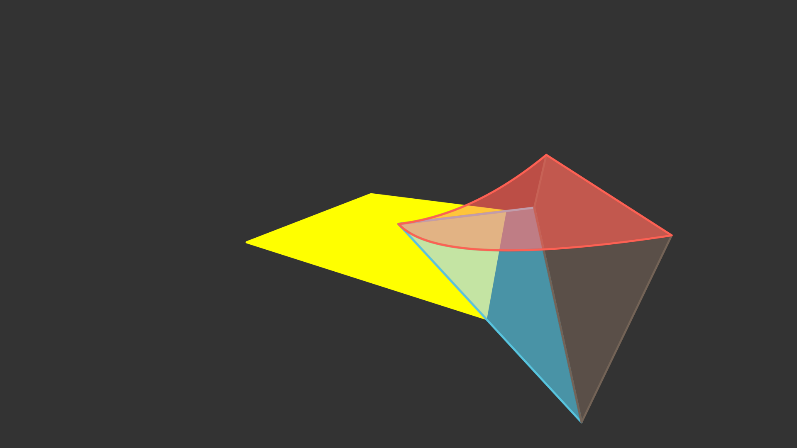
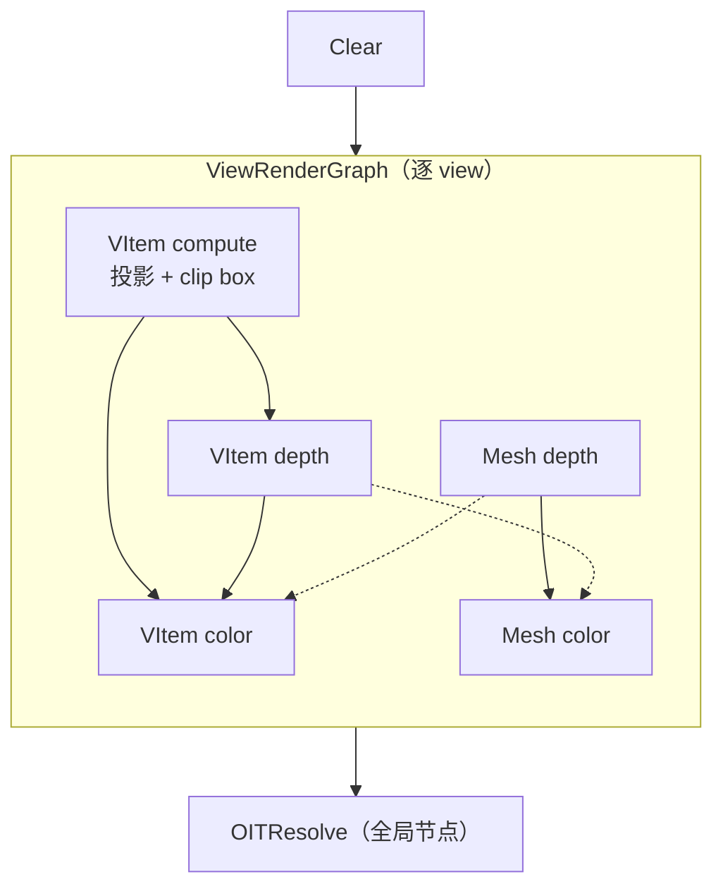
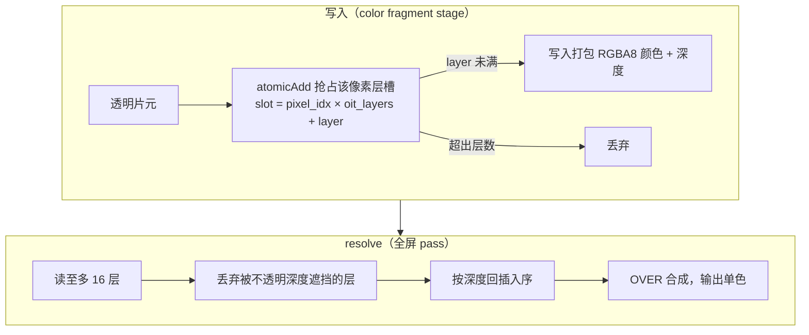
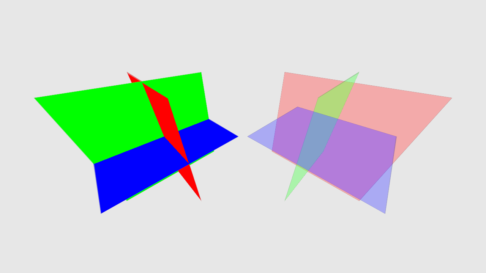
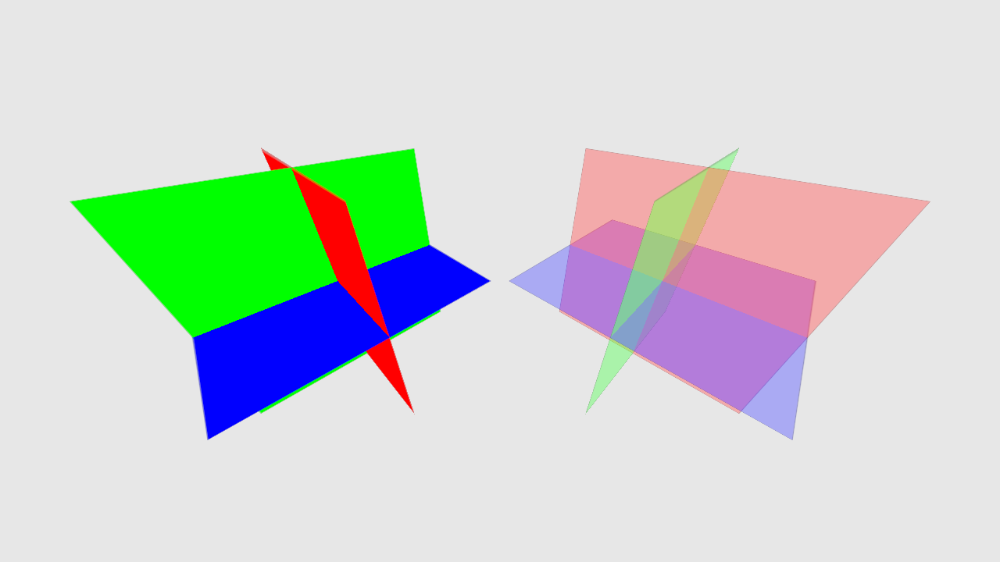
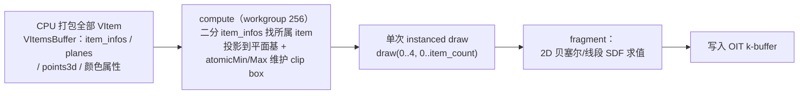
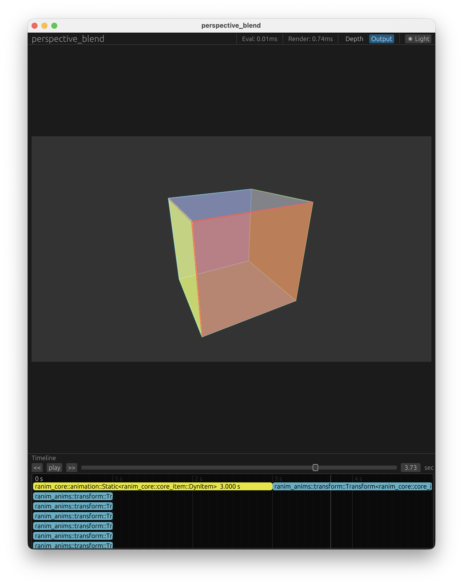
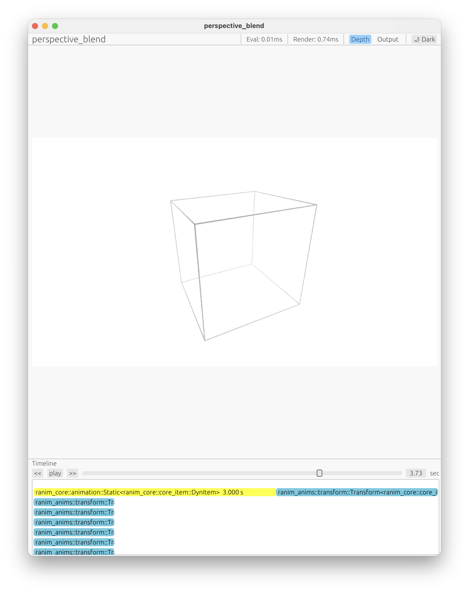

# v0.2

> **Status: Backfilled（补写）** — 覆盖 #99–#163；按 v0.2.0（2026-04-05）/ v0.2.1（2026-05-28）发布时点快照描述。

v0.2 的主线是把 v0.1 末期的两块"实验田"种成正文：**动画编码**去掉 item 状态、变成纯可求值的编码（#99/#104），**渲染**走进度缓冲与 OIT、再以 GPU-driven 合批收尾（#107–#112、#138/#142），然后顺势进入 3D（#146 MeshItem）。与此同时几何构造器、锚点体系与输出格式迅速铺开，包结构完成了"ranim-core 是纯动画引擎"的定位重构。

## 新增

- 动画编码重写：`AnimationCell` + 单方法 `Eval<T>` trait，`Timeline` 不再存 item 状态，`RanimScene::seal()` 后任意时刻可独立求值（见"动画编码重写"一节）
- 渲染：平面基 VItem 与真深度（depth pre-pass）、RenderGraph、OIT（flattened k-buffer）、GPU-driven 合批（单 instanced draw）、双缓冲读回（见"渲染"各节）
- `MeshItem`/`Surface`/`Sphere`：3D 网格渲染，Z-up 球坐标相机
- 几何与锚点：`Arc`/`Circle`/`RegularPolygon`/`Ellipse`/`EllipticArc`/`Parallelogram`/`Line` 构造器，`Locate<T>` 锚点体系（`Origin`/`Focus`/`Centroid`），`TextItem`（Typst SVG）
- 输出：多格式（Mp4/Webm/Mov ProRes 4444/Gif）、`#[output]` 多路输出、帧级精确的采样时序、4K 输出
- 包结构：ranim-core 纯化、`ranim-app` 并入 `ranim`、`#[scene]` 生成同名 module

## BREAKING CHANGES

- **动画编码**：`Evaluator<T>`/`AnimationSpan<T>`/`ItemTimeline<T>` 移除，动画统一为 `AnimationCell`（`Box<dyn Eval>` + `AnimationInfo`），场景 API 改为 `RanimScene::{insert, insert_with, timeline_mut, seal}`（#99/#104）
- **VItem 数据模型**：旧的 3D 点列表 `VItem` 移除，VItem 变为平面基表示（`origin` + `Basis2d` + 平面内 2D 点，每点带 `is_closed`）（#107/#112）
- **锚点与 trait 重命名**：`BoundingBox` → `Aabb`（`aabb()/aabb_size()/aabb_center()`），enum 锚点 → `Locate<T>` trait + `AabbPoint`；场景 API `new_timeline*` → `insert_empty*`（#120）
- **`Rectangle` 构造语义**：`p1`/`p2` 从左上/右下改为最小/最大角（数学惯例的向上 Y）（#116）
- **`CameraFrame::phi`**：从"相对 XY 平面的仰角"改为"Z-up 坐系下相对 +Z 的极角"，迁移：`PI/2 - old_phi`（#146）
- **`Output.dir`**：不再拼接在固定 `./output/` 下，即输出目录本身；默认值 `"./"` → `"./output"`（#159）
- **宏属性**：`pixel_size = (w, h)` → `width = w, height = h`；`frame_rate = n` → `fps = n`（#161）
- **包结构**：`Scene`/`Output`/`OutputFormat` 等类型从 *ranim-core* 移至 *ranim*；`ranim-app` 并入 `ranim`（feature `render`/`preview`）（#133/#143）

## 动画编码重写：从带状态的 Timeline 到纯编码

相关 PR：#99（动画实现重构）、#104（移除 timeline 状态），对应 issue #95（改进动画编码结构）。

v0.1 末期的动画编码有两块累赘：`Evaluator<T>`/`AnimationSpan<T>` 的双层抽象带着 `Arc` 引用计数管线，`ItemTimeline<T>` 在动画列表之外还维护一份**实时更新的 item 状态** `state: T`。状态意味着求值必须顺序推进——预览想 scrub 到任意时刻就得重放。

重写后的编码是纯数据：

- `trait Eval<T> { fn eval_alpha(&self, alpha: f64) -> T; }`——"动画基本上是时间上的函数"（单方法 `Eval` trait 在此确立，v0.3 进一步演化为关联类型版本，见 v0.3 篇）；
- `AnimationCell<T> { inner: Box<dyn Eval<T>>, info: AnimationInfo, anim_name }` 统一承载动画，`AnimationInfo { rate_func, start_sec, duration_secs, enabled }` 持有全部播放参数（默认速率函数 `linear`）；
- `Timeline` 只持 `Vec<Box<dyn CoreItemAnimation>>` 加构造期游标（`cur_sec`/`planning_static_start_sec`），`show()`/`hide()` 用 `Static` 动画把窗口外的末态物化进编码，**item 状态不再被存储**，任意 `sec` 经 `eval_at_sec` 独立求值；
- 场景层：`RanimScene { timelines, time_marks }`、`seal() -> SealedRanimScene`（`total_secs` + `eval_at_sec` 产出 `((timeline_idx, anim_idx), CoreItem)` 流）、`TimeMark::Capture` 标记；`Extract` 的 `extract_into(&self, &mut Vec<Target>)` 形状也由此确立。

> 注意 `Timeline` 仍保留构造期游标（`cur_sec`/`planning_static_start_sec`），被移除的是 item 的实时状态；预览 UI 的 `TimelineState`（egui 控件）不受影响。

#99 同时把 eval 基准提升 20–30%（render 约 1%）。

## 渲染 I：平面化 VItem、深度与 OIT

相关 PR：#107（VItem2d 实验）、#109（RenderGraph）、#110（OIT 实验）、#112（转正），对应 issue #102（深度）/ #105（OIT）/ #106（RenderGraph）

### VItem2d：点有了真深度（#107）

旧 VItem 是一列 3D 点，在 compute shader 里投影到相机平面——问题在于"当角点更多时，实际上无法定义曲面的形状"。

#107 把 VItem 换成**平面表示**：`origin` + `Basis2d`（平面在 3D 中的正交基）+ 平面内的 2D 点，每个点因此有了深度信息，也为日后与 3D mesh item 无缝融合铺路（"will be added in future"——后来是 #146）。分层关系不再依赖插入顺序，而是有了真正的 depth pre-pass：`Depth32Float` 深度缓冲 + `VItem2dDepth`/`VItem2dColor` 双 pass + 一个 compute pass 做 2D clip box。

### RenderGraph（#109）

渲染循环从硬编码改为声明式节点图：`GlobalRenderGraph`（slotmap 存节点）上每个节点实现 `GlobalRenderNodeTrait`，以关联 `Query: RenderPacketsQuery` 从 `RenderPackets` 存储取输入（元组查询经 `variadics_please` 生成）；资源侧出现 `RenderPool`/`PipelinesPool`/`RenderTextures`。节点图在此之后持续演化，直到 v0.3 被 Bevy ECS schedule 取代（见 v0.3 篇）。v0.2.0 定型的默认渲染图（含 #146 加入的 mesh 节点与两条交叉边）：

交叉边 `Mesh depth → VItem color`、`VItem depth → Mesh color` 正是"深度 pre-pass 跨基元类型生效"的关键——两类物件的深度互相参与对方 color pass 的遮挡判定。

### OIT：flattened k-buffer（#110/#112）

透明物件自遮挡时的混合顺序错误，v0.1 用插入顺序回避，v0.2 用**逐像素分层 k-buffer** 正面解决：

1. 写入：color fragment stage 用 `atomicAdd` 抢占该像素的层槽（`pixel_idx * oit_layers + layer`），写入打包成 `u32` 的 RGBA8 颜色与深度；超出 `oit_layers` 的片元丢弃；
2. resolve：全屏 pass 每像素取至多 16 层，**先丢弃被不透明深度遮挡的层**，回插入序后从后往前 OVER 合成输出。

效果肉眼可见——同一场景的透明物件，无 OIT 时可见性取决于绘制顺序，k-buffer 解析后按深度逐片正确合成（左半场景是不透明物件，作为不受影响的参照）：

层显式可配（`Renderer::new(ctx, width, height, oit_layers)`，后来 #156 在预览里按设备缓冲上限自适应）。

### 转正（#112）

`vitem2d` feature 与 `CoreItem::VItem2D` 变体删除，实验代码合并为唯一的 `core_item::vitem.rs`——旧 3D 点列表 VItem 与它的 `map_3d_to_2d` 投影管线整体拆除（diff 净 -1335 行），OITResolve 成为默认渲染图的常驻节点。

## 渲染 II：GPU-driven 合批

相关 PR：#138（实验）、#142（删除 per-item pipeline），对应 issue #139/#140

每个 VItem 一份 GPU buffer/bind group 的提交方式让 CPU 提交时间随物件数线性增长（3600 items 时 220 ms）。#138/#142 的方案是**CPU 数据合并 + 单次 instanced draw + GPU 侧计算**：

- 每帧把全部 VItem 打包进连续 buffer（`VItemsBuffer`）：`item_infos` 索引表、`planes`、`points3d`、描边宽度与填/描色属性；
- compute pass（workgroup 256）每点一个 invocation：二分 `item_infos` 找到所属 item，把 3D 世界坐标点投影到平面基上，并用 `atomicMin`/`atomicMax` 维护每 item 的定 点 clip box（含描边宽度的四边形扩张界）；
- 渲染 pass 完全 instanced（`draw(0..4, 0..item_count)`）：vertex 阶段按 clip box 生成每 item 大小的 quad，fragment 阶段做 2D 二次贝塞尔/线段的符号距离求值再写入 OIT k-buffer。注意这不是 indirect draw 式的 GPU-driven——裁剪与 quad 尺寸由 GPU 算，draw 调用仍是 CPU 发的单次 instanced。

CPU 提交成本自此与 VItem 数量无关（bench `gpu_render`）：

| VItem 数 | CPU 提交（前） | CPU 提交（后） | 提升 |
|---|---|---|---|
| 25 | 1.61 ms | 1.64 ms | ~1× |
| 400 | 25.2 ms | 1.79 ms | 14× |
| 3600 | 220 ms | 1.90 ms | 116× |

CPU+GPU 总耗时在 3600 items 下 256 ms → 5.0 ms（51×），输出与旧路径逐像素一致（含 OIT 与深度排序）。#142 同日把旧 per-item 路径整体删除，实验直接转正。

## 渲染 III：双缓冲读回

#132（closes #119）

输出纹理从 `Renderer` 中拆出，读回异步化：`start_readback`（非阻塞入队）/ `finish_readback`（阻塞拷回）/ `try_finish_readback`。渲染循环读回第 N 帧与渲染第 N+1 帧重叠，报告约 +20% 吞吐。

## MeshItem：进入 3D

#146（closes #101）

`MeshItem { points, triangle_indices, transform, vertex_colors, vertex_normals }` 落地（v0.2 篇时代它还内嵌 `transform: Mat4`——v0.3 的变换系统重构会把它移出，见 v0.3 篇）：

- *ranim-items* 侧配套 `Surface`（参数曲面 `(u, v) -> DVec3` 网格生成）与 `Sphere`；`CameraFrame` 获得 Z-up 球坐标定位（`from_spherical`/`set_spherical`）与 `orbit` 动画；
- 渲染走合批路径（`MeshItemsBuffer` + depth/color 节点，与 vitem 节点交叉连边），空/零法向时 shader 以 `dpdx`/`dpdy` 回退平面着色；
- trait 全覆盖：`Interpolatable`（顶点/颜色/法向/transform 插值，索引在 t=0.5 切换）、`Alignable`（不同拓扑间自动补点）、`Extract` → `CoreItem::MeshItem`；
- 新 example：`mesh_morph`（圆盘↔环面）、`perlin_terrain`（Perlin/分形/侵蚀地形）、`solar_system`、`tetrahedron_spheres`。

## 几何与锚点

相关 PR：#116、#120、#123、#128、#129、#149、#150

- **锚点体系**（#120，closes #117）：enum 锚点换成 `Locate<T>` trait——"任何类型都可以是锚点"，为它实现 `locate(&self, target: &T) -> DVec3` 即可；内置 `DVec3`（自身即锚点）与 `AabbPoint`（bbox 相对坐标，原点为中心）。`BoundingBox` 更名 `Aabb`，`get_min_max` 去掉冗余中点返回（#116）；transform trait 收缩为最小方法（`rotate_at_point`/`scale_at_point`/`shift`），其余进 extension trait 且不再依赖 bbox；
- **几何家族**：`Rectangle` 构造语义改为最小/最大角（向上 Y 的数学惯例，#116）并新增 `from_min_size`/`from_two_points`；`Arc`/`ArcBetweenPoints`/`Circle`/`RegularPolygon`（#123，附 `Origin` 锚点）；`Ellipse`/`EllipticArc`（#128，附 `Focus` 锚点，`VPointVec` 的 AABB 改为曲线感知）；`Parallelogram` 与 `TextItem`（#129）；`Line` 线段 item（#150）；
- **`TextItem`**：单行文本，内部经 Typst 产出 SVG → `SvgItem` → VItems，携带 `TextFont`（字体族、`FontVariant`/`FontWeight` 等）；
- `OpaqueColor` 获得 `Interpolatable`（#149）。

## 输出体系

相关 PR：#125、#126、#137、#156、#159、#163

- **去掉静态限制**（#125）：`#[scene]` 宏生成 `StaticScene`/`StaticOutput`/`StaticSceneConfig`（C-ABI 友好）并可转 owned `Scene`；`find_scene` 返回 owned 值，render/preview API 一律收 `&Scene`；新增 `render_scene!`/`preview_scene!` 声明宏直接以场景函数名调用；
- **多格式输出**（#126）：`#[output(format = "...")]` 支持一个场景多路输出，格式矩阵如下；ffmpeg 参数顺序一并理顺，MOV 输出稳定正确；新增 `rotating(angle, axis)` 旋转动画（逐帧增量旋转的真实圆弧运动，区别于首末态线性插值的 `Transform`）；

  | 格式 | codec / 像素格式 | alpha | 备注 |
  |---|---|---|---|
  | Mp4（默认） | libx264 / yuv420p | ✗ | — |
  | Webm | libvpx-vp9 / yuva420p | ✓ | 透明视频 |
  | Mov | prores_ks / yuva444p10le（ProRes 4444） | ✓ | macOS 可直接预览 |
  | Gif | gif / rgb8 | ✗ | 厘秒计时，fps 上限 50 |
- **帧采样间隔修复**（#137，fixes #136）：渲染循环此前按 `i/(N-1)` 取 N 个闭区间采样点，把帧距从 `1/N` 拉伸成 `1/(N-1)`——视频时长与速度有细微错误。改为按 `i/fps` 常距采样 `ceil(total_secs * fps) + 1` 帧，末帧精确收在 `total_secs`，并直接走 `eval_at_sec` 免去 sec→alpha→sec 往返；
- **预览体验**（#114/#156/#159）：v0.1 的手写 winit 预览原型重构到 eframe 之上，新增深度缓冲可视化、eval/render 耗时显示与亮暗主题切换（#114，closes #78）；动态分辨率与宽高比预设（切换时按设备缓冲上限自动下调 OIT 层数）、播放传输条（逐帧/跳转/循环/0.1×–10× 变速）、导出对话框带进度、图标从 emoji 换成 `egui-phosphor`（#156/#159）；新增 `render_scene_output_with_progress` 进度回调；`Output.dir` 语义简化为直出目录；

  

  
- **4K 输出**（#163，v0.2.1 唯一 PR，来自外部贡献者 @pointer-to-bios，致谢！）：设备创建改用 `adapter.limits()`，OIT storage buffer 在 UHD 下不再触及默认上限——4K 自此开箱即用（预览侧的分辨率自适应见 #156）。

## 包结构：ranim-core 成为纯动画引擎

相关 PR：#133、#143、#144（依赖维护）、#161（发布准备）

- **ranim-core 纯化**（#133，closes #131）：`Scene`/`Output`/`OutputFormat`/`SceneConfig`/`SceneConstructor` 与 `link_magic`（inventory 注册 + FFI 导出）全部移出 *ranim-core* 进 *ranim*，`inventory`/`wasm-bindgen` 依赖随之离开核心；依赖翻转——`ranim-app` 改为依赖 `ranim` + `ranim-render` 而非 `ranim-core`；`#[scene]` 不再靠 `paste!` 拼 `_SCENE` static，而是生成同名 module（Rust 允许 `fn` 与 `mod` 同名）导出 `pub fn scene() -> Scene`；渲染相关依赖按 `cfg(not(target_family = "wasm"))` 隔离，book 新增包结构一章；
- **ranim-app 并入 ranim**（#143）：独立 crate 消失，`render_scene!`/`preview_scene!` 变成 `ranim` 在 `render`/`preview` feature 下的导出，packages/ 收敛为 ranim-anims、ranim-cli、ranim-core、ranim-items、ranim-macros、ranim-render 六个；
- **v0.2.0 发布准备**（#161）：宏属性与字段对齐（`pixel_size` → `width`/`height`，`frame_rate` → `fps`），egui 0.34 + wgpu 29，book 清理与 getting started 重写。

v0.2.1（2026-05-28）携带 #163 的 4K 支持与两笔直接推送的依赖维护。
