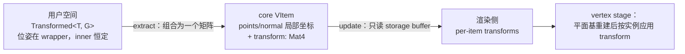
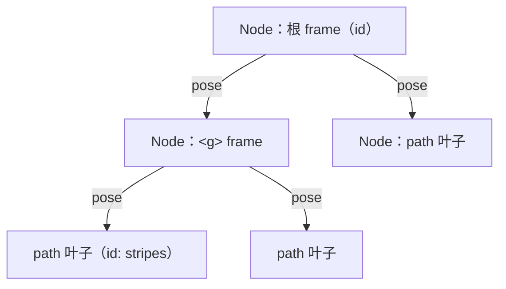

# v0.3

> **Status: Draft** — 随 main 更新，v0.3 发布时冻结。
> 已覆盖 #166–#202 中的全部特性与架构类 PR；基建/修复类（#178、#179、#188、#191、#199、#203）不入篇（见[目录约定](../AGENTS.md)）。

本篇是 v0.3 的 News 纪事（体裁类似 Bevy News，写作约定见
[本目录 AGENTS.md](../AGENTS.md)）。其中编排系统与渲染侧的 ECS 化沿用了
各自 PR 的设计；求值协议一节按当前实现（content-is-sequence 收敛后的
版本）编写。

## 新增

- 可组合动画编排系统（见 "Composable Animation Arrangement" 一节）
  - `AnimSequence`/`AnimStack` 容器与 `seq!`/`stack!` 宏，`hold`/`forward`/`extend` 等编排 API
  - `AnimLagged` 容器（stagger 排布 + 窗口外静态填充）与 `lagged!` 宏、迭代器容器收集（`collect::<AnimStack>()`/`collect::<AnimSequence>()`、`into_stack`/`into_seq`/`into_lagged`）
  - 播放参数 `Paramed<A>`（`with_duration`/`with_rate_func`/`with_enabled`）与放置 `At<A>`
- 求值协议与适配器（见"求值与迭代式动画区段"一节）
  - 单一 `Eval` 协议：`eval_alpha(&self, alpha)` 是叶子动画唯一的求值入口
  - 进度是唯一坐标：`Time`/`DeltaTime` 结构已删除，`ranim_core::time` 只保留 `Alpha`/`DeltaAlpha` 两个类型别名
  - 纯/迭代特化位于 *ranim-core*：`Pure` 包装闭式闭包，`Iterative` 包装 `IterativeEval` step 逻辑；闭包经 `Pure::new(|alpha| ...)` / `Iterative::from_fn(state, step_fn)` 成为动画
  - `SceneEvaluator::sample_at` 是唯一 session 交互，seek/重放由 stateful 节点内部完成
- 类型化变换系统（见"类型化变换系统"一节）
  - `Transformed<T, G>` 包装器、`ApplyTransform<G>` primitive trait 与类型化变换群（`Translation`/`Rigid`/`Similarity`/`Diag`/`DAffine3`），语义闭包约束的 `bake()`
  - 规范局部原语：语义形状移除定位字段，placement 只存在于 `Transformed`（"canonical local primitives" 教义）
  - 核心 `VItem` 携带局部到世界 `transform: Mat4`，渲染侧 per-item transform storage buffer，插值契约（wrapper lerp 动位姿、morph 是显式 bake）
  - 场景图层级 `hierarchy::Node` 与 glTF/GLB 导入（见"场景图层级与 glTF 导入"一节）
- VItem 法向投影：`Basis2d` 移除，`normal: Option` + shader 内现场生成正交基（见"VItem 法向投影"一节）
- 元组 `Extract`：1..=15 元直接实现，无需 `Group` 包装，ranim-core 保持 stable 兼容
- CLI：`ranim output` / `ranim render <scene>` 拆分；`inspect scenes/tree/frame` 无 GPU 检查子命令；`examples/agents/` agent one-shot 例子档案（见"CLI"一节）
- 渲染与输出：渲染 worker API（`RenderWorker`/`RenderThreadHandle`/`RanimRenderApp`）公开；`Output::name_template` 输出名模板；examples 打包为单一 `ranim-examples` wasm 包并经 `#[wasm_demo_doc]` 恢复 rustdoc 实时预览；coplanar z-fighting 按 scene-order 深度偏置解决

## BREAKING CHANGES

- 动画组织系统
  - 弃用 `Timeline`（迁移到 `AnimSequence`/`AnimStack`）
  - `AnimationCell<T>` 的泛型参数移除、不再直接构建（`Eval` 类型可直接作为动画使用）；原先 `AnimationCell<T>` 的 `AnimationInfo` 参数改为 `Paramed<A>` 和 `At<A>`
  - *ranim-anims* 中全部内置动画创建工具方法现在默认用 `linear` 速率函数和 `1.0` 持续秒数
- 求值与内置动画 API
  - `Eval<T>` 泛型参数改为关联类型，方法集收敛为单一 `eval_alpha(&self, alpha)`（见"求值与迭代式动画区段"一节）；`sample`/`reset`/`step` 与 `PureEval` 已删除
  - `Time`/`DeltaTime` 结构已删除；`Eval::eval_alpha` 收 `f64`，`IterativeEval::step` 收 `alpha`/`delta_alpha`
  - 内置动画工具方法直接返回具名动画类型（如 `fade_in()` 返回 `FadeIn<T>`），这些类型直接实现 `Eval`
  - `Pure` 与 `Iterative` 从 *ranim-anims* 移入 *ranim-core* 的 `animation::eval::{pure, iterative}`
  - `CameraFrame::orbit` 移到 *ranim-anims* 的 `CameraFrameAnim`
  - 删除 *ranim-anims* 的 `Lagged` 求值器与 `lagged` 模块（`LaggedAnim` 糖），stagger 排布改用 `AnimLagged` 容器
- 变换与物件模型（见"类型化变换系统"一节）
  - `MeshItem`/`Surface` 移除内嵌 transform 字段与 `with_transform`，外挂变换改用 `.transformed(...)`
  - `Square`/`Rectangle`/`Circle`/`Sphere`/`Arc`/`Ellipse`/`EllipticArc`/`TextItem` 等语义形状移除 `center`/`axes`/`p0`/`origin` 等定位字段：构造后用 `.transformed(Translation(...))` 放置；裸值不再实现 `ApplyTransform`，`shift`/`rotate_*`/非均匀 `scale` 需先包裹（或转为 `Polygon`/`VItem` 等点集类型）
  - 核心 `VItem` 的 `points`/`normal` 变为局部空间值，定位存放在新增的 `transform: Mat4`；消费提取点数据的代码需先应用 transform
  - `ranim_items::mesh::MeshItem` 用户层类型由 f32（`Vec3`/`Mat4`）改为 f64（`DVec3`/`DMat4`）
- 渲染与 CLI
  - `VItemsBuffer::update`/`MeshItemsBuffer::update` 的迭代项改为 `(scene_order, item)` 对
  - `ranim render` 语义变化：批量渲染所有 `#[output]` 改用 `ranim output`；`ranim render <scene>` 只做单场景临时渲染，忽略 `#[output]` 与 Capture mark
  - `ranim_items::vitem::Basis2d` 移除，`VItem.basis` 改为 `normal: Option<DVec3>`（构造迁移：`with_basis(Basis2d::XY)` → `with_normal(...)` 或留空自动计算）
  - `SvgItem` 内部改为放置树（`Transformed<Node<VItem>, DAffine3>`）：`tree()`/`tree_mut()`/`into_tree()` 返回放置而非裸节点（用 `.inner` 取 frame）；glTF 支持为 opt-in 的 `gltf` feature

## Composable Animation Arrangement

https://github.com/AzurIce/ranim/pull/170

### `AnimSequence` 和 `AnimStack`

Ranim 动画编排的本质是构造动画数据表示并放入集合，在之前的设计中整个 `RanimScene` 通过内部的 `Vec<Timeline>` 来维护动画。

`Timeline` 的本质是 `Vec<Box<dyn CoreItemAnimation>>` 动画序列容器，其中的每个元素都是前后相继的动画表示，同一时间一个 `Timeline` 只有一个动画激活，于是以前在动画组合代数上非常局限：
- 串行的动画必须通过 `Timeline` 的 API 手动推进/同步时间到对应位置
- 并行的动画必须通过创建新的 `Timeline` 来实现
- 整个场景的 `Vec<Timeline>` 本质是一次性并行组合多个串行编排的性质

在 Ranim v0.3 中，原本的 `Timeline` 被弃用，新增了两个可组合的基本动画容器 `AnimSequence` 和 `AnimStack`。

比如对于如下的动画：

- 正方形：0.0s ~ 1.0s 淡入 | 1.0s ~ 2.0s 变成圆形 | 2.0s ~ 3.0s 淡出
- 文字：0.5s ~ 1.5s 写入 | 1.5s ~ 2.5s 擦除

在以前的 Timeline API 下要这样编写：

```rust
let r_vitem = r.insert_with(|t| {
    t.play(item.fade_in())
        .play(item.morph_to(VItem::from(Circle::default())))
        .play(item.fade_out())
});
let r_text = r.insert_with(|t| {
    t.forward(0.5)
        .play(text.write())
        .play(text.unwrite())
});
```

而使用 `AnimSequence` 和 `AnimStack` 可以这样：

```rust
let anim = stack![
    seq![
        item.fade_in(),
        item.morph_to(VItem::from(Circle::default())),
        item.fade_out(),
    ],
    seq![
        text.write(),
        text.unwrite()
    ].at(0.5)
];
r.play(anim);
```

其中的 `seq!` 和 `stack!`（类似 `vec!`），会构造 `AnimSequence` 和 `AnimStack` 并将动画插入其中（类似 `Vec`）。

如果要把这段动画播放两遍，原来的 Timeline API 会非常繁琐，或许需要将相关时间线操作封装为闭包，而对于新的可组合 API 很简单：

```rust
r.play(seq![anim.clone(), anim]);
```

更能够表现新系统的可组合与复用能力的例子见 `composable_choreaography` example。

### `AnimationCell`、`Eval` 与 `Animation` Trait

`Eval<T>` 的泛型参数被移除并改成了关联类型（一个求值器类型的求值结果类型是唯一的）。

以前 `AnimationCell<T>` 被当作动画的组织单元，所有动画必须被表示为 `AnimationCell<T>` 才能够被插入时间线。现在这个行为被抽象为了一个 `Animation` Trait：

```rust
/// A statically typed animation definition that can be lowered into a runtime animation.
pub trait Animation: Sized {
    /// Lower this definition into its local runtime representation.
    fn build(self) -> AnimationCell;
}
```

同时泛型参数被从 `AnimationCell` 移除，其内部变成类型擦除的 `Box<dyn EvalDyn>`。

所有的 `E: Eval where E::Output: AnyExtractCoreItem` 都自动实现了 `Animation`，于是所有的动画创建都不必返回 `AnimationCell`，可以直接返回自己就可以使用。

```rust
// previous
impl<T: FadingRequirement + Sized + 'static> FadingAnim for T {
    fn fade_in(&mut self) -> AnimationCell<Self> {
        FadeIn::new(self.clone())
            .into_animation_cell()
            .with_rate_func(smooth)
            .apply_to(self)
    }
    fn fade_out(&mut self) -> AnimationCell<Self> {
        FadeOut::new(self.clone())
            .into_animation_cell()
            .with_rate_func(smooth)
            .apply_to(self)
    }
}
```

```rust
impl<T: FadingRequirement + Sized + 'static> FadingAnim for T {
    fn fade_in(&mut self) -> FadeIn<Self> {
        FadeIn::new(self.clone()).apply_to(self)
    }
    fn fade_out(&mut self) -> FadeOut<Self> {
        FadeOut::new(self.clone()).apply_to(self)
    }
}
```

`Animation` Trait 也是可组合动画的核心，`AnimSequence`、`AnimStack`、`Paramed<A>` 和 `At<A>` 也实现了该 Trait，可以当作一个动画使用。

### `AnimLagged` 与迭代器收集

stagger 排布由 `AnimLagged` 容器表达：

```rust
let animation = lagged![0.2; a.fade_in(), b.fade_in(), c.write()];
```

- 子动画要求 `Placeable`（和 `AnimSequence` 一样），放置由容器计算：`start_i = start_{i-1} + lag_ratio · d_{i-1}`。`lag_ratio` 因此是 `AnimStack`（0.0，同时）与 `AnimSequence`（1.0，相继）之间的插值；
- 窗口外时间由 `with_leading`/`with_trailing` 配置（`LaggedFill::{Hold, Empty}`，默认都 `Hold`）：每个元素在 build 时被物化为一条 `[前填充][动画][后填充]` 的 per-item `AnimSequence` 轨道（前=初态、后=末态，采样自窗口边缘；空填充跳过；零时长子项跳过前填充）——preview 时间线所见即所得，没有隐藏的钳制规则。想让元素窗口后消失，让它的动画以 `hide` 结尾（`seq![item.fade_in(), item.hide()]`）；
- 由于填充在 build 时采样，子动画应当是纯（闭式）动画；
- 子动画是完整的 `Animation`：可以自带 `with_rate_func`/`with_duration` 等播放参数，容器在各自 cell 上施加速率；

```mermaid
gantt
    dateFormat X
    axisFormat %s
    title lagged 容器窗口示意（lag_ratio 0.2）
    section a
    动画 :a1, 0, 5
    后填充（末态 Hold） :a2, 5, 7
    section b
    前填充（初态 Hold） :b0, 0, 1
    动画 :b1, 1, 6
    后填充（末态 Hold） :b2, 6, 7
    section c
    前填充（初态 Hold） :c0, 0, 2
    动画 :c1, 2, 7
```

- 配套迭代器 API：`collect::<AnimStack>()`/`collect::<AnimSequence>()`（`FromIterator`）与 `AnimIterExt::{into_stack, into_seq, into_lagged}`。

窗口与填充语义一张图看懂——示意 `lagged![0.2; a, b, c]`、各动画 1 秒、默认 `Hold` 填充（时间轴单位 0.2 秒）：



### `Paramed<A>`、`At<A>`

动画本身在时间轴上“长什么样子”并不依赖于其起始时间，只有在要 **放置** 在某种时间坐标上的时候起始时间才存在作用。对于 `AnimSequence` 和 `AnimStack` 来说，前者反而要求动画没有被指定起始时间，因为动画要被相继紧接着放置进序列中。

原先统一在 `AnimationInfo` 内的动画参数现在拆分到了 `Paramed<A>` 和 `At<A>` 两个泛型结构体内：

```rust
/// An animation definition with overridden playback parameters.
pub struct Paramed<A> {
    inner: A,
    param: AnimationParam,
}

/// An animation fixed at an offset in its parent's time coordinates.
///
/// This is a terminal placement entry: it implements [`Animation`] but not
/// [`Placeable`], so playback parameters must be configured before calling
/// [`Placeable::at`].
pub struct At<A> {
    inner: A,
    offset_sec: f64,
}
```

使用 `.with_duration`、`with_rate_func`、`with_enabled` 会自动修改或包裹 `Paramed<A>`，使用 `.at` 会自动包裹 `At<A>`。

## Preview App 时间轴控件重构

在新的动画组织系统下，Preview App 的时间轴控件也对应做了大幅重构：


## ECS Schedule 取代 RenderGraph

https://github.com/AzurIce/ranim/pull/175

渲染侧的 ECS 化：渲染原语进入内部 `RenderWorld`，渲染准备与 GPU pass 由 schedule 组织；用户级 item、动画求值仍停留在 World 之外。

### 之前：`CoreItemStore` 兼任传输与查询

旧实现里，求值结果由 `CoreItemStore` 承载：

```rust
/// A store of [`CoreItem`]s.
#[derive(Default, Clone)]
pub struct CoreItemStore {
    /// Id of [`CameraFrame`]s
    pub camera_frame_ids: Vec<(usize, usize)>,
    /// [`CameraFrame`]s
    pub camera_frames: Vec<CameraFrame>,

    /// Id of [`VItem`]s
    pub vitem_ids: Vec<(usize, usize)>,
    /// [`VItem`]s
    pub vitems: Vec<VItem>,

    /// Id of [`MeshItem`]s
    pub mesh_item_ids: Vec<(usize, usize)>,
    /// [`MeshItem`]s
    pub mesh_items: Vec<MeshItem>,
}
```

它既用于承载并传输求值结果，又用于渲染管线查询访问——两种职责混在一起。

### 现在：`RenderFrame` 传输 + `RenderWorld` 查询

拆分为了 `RenderFrame`（帧级传输缓冲）和 `Renderer` 内部的 ECS World：

```rust
/// A reusable, frame-local transport buffer between evaluation and rendering.
#[derive(Default)]
pub struct RenderFrame {
    items: Vec<(CoreItemId, CoreItem)>,
}
```

```rust
pub struct Renderer {
    width: u32,
    height: u32,
    world: World,
}
```

前者只用于传输（求值线程 → 渲染线程），后者用于承载运行时的查询、变更检测与 schedule。

### Reconcile：按身份增量更新实体

每帧从 `RenderFrame` 更新 `World`，再运行渲染 Schedule：

```rust
/// Reconcile and render one evaluated frame.
pub fn render_frame(
    &mut self,
    render_textures: &mut RenderTextures,
    clear_color: wgpu::Color,
    frame: &RenderFrame,
) {
    reconcile(&mut self.world, frame);
    self.world
        .insert_resource(FrameTarget::new(render_textures, clear_color));
    self.world.run_schedule(RenderPrepare);
    self.world.run_schedule(RenderGraph);
}
```

reconcile 以 `CoreItemIdentity(animation_id, part)` 为跨帧 key，从 `RenderFrame` 更新渲染 `World`：

- 每个实体携带 `CoreItemIdentity` 与 `SceneOrder`；值相同则不写组件（保留 `Changed<T>`），值变化才替换，本帧消失的 key 对应实体被移除；
- **身份与顺序是两件事**：`CoreItemIdentity` 回答"是否是上一帧的同一项"，`SceneOrder` 回答"本帧按什么顺序消费"——ECS query 顺序不构成绘制顺序，prepare 阶段显式按 `SceneOrder` 排序分桶；

### Schedule 组织渲染阶段

```text
RenderPrepare:  Collect → PrepareResources → Upload → PrepareBindGroups
RenderGraph:    Begin → Render → Submit → Finish
  └─ ViewRender: Clear → Compute → Depth → Color → OITResolve
```

- `RenderPrepare` 把组件展开为 GPU 输入（storage/index/uniform 数据、上传、绑定组）；
- `RenderGraph` 驱动整个画面生命周期：`Begin` 创建 frame encoder，`Render` 运行逐 view 子 schedule，`Submit` 提交 command buffer，`Finish` 结束 profiling frame；
- 单相机也走完整的 `ViewRender` 子 schedule（clear、VItem compute、depth、color、OIT resolve），避免单 view 成为以后多 view 的特殊路径；
- 自制的 `Graph<NodeKey, Box<dyn RenderNode>>` 节点图被移除——节点 trait、拓扑容器和查询都在重复 ECS schedule 已提供的能力。

## 求值与迭代式动画区段

相关 PR：#177（有状态区段引入）、#183（统一协议与容器重组）、#186（纯 eval_alpha 收敛）。本节按当前 content-is-sequence 收敛后的实现编写。

v0.2 的动画区段都是**函数式**的：从归一化进度闭式采样。这类区段无法表达**有状态的迭代式动画**（粒子、弹簧、物理模拟、三体），因为求值器无法保留跨帧状态、也无法按 `dt` 推进。v0.3 用一套通用求值协议统一两类区段，并最终把协议收敛为对进度的纯查询。

### 单一 `Eval` 协议

纯（闭式）与迭代（有状态）区段底层是同一个协议。动画内容一旦定义就不可变，evaluator 只回答一个问题：在自身归一化进度 `alpha ∈ [0, 1]` 处的输出是什么。

```rust
pub trait Eval {
    type Output;

    /// 在归一化进度 alpha 处求值。
    fn eval_alpha(&self, alpha: f64) -> Self::Output;
}
```

- `eval_alpha` 是 `&self` 上的纯查询：同一个 `alpha` 永远得到同一个 `Output`，与调用顺序和次数无关；
- evaluator 看不到秒、场景时钟或 `logic_fps`；`AnimationCell` 负责把场景时间映射成 `alpha` 后再调用它；
- 有状态区段在内部记忆化自己的积分快照；纯区段就是闭式函数。

`EvalExt::apply_to` / `apply_alpha_to` 是 build 期便捷方法：它们通过 `eval_alpha` 把 item 写成指定进度（默认末态）并返回动画本身。内置动画的工具方法（`fade_in()` 等）正是靠 `apply_to` 在创建动画的同时把 item 置为末态。

### 纯闭包：`Pure`

闭包是匿名类型，不能按名字实现 `Eval`，所以用 `ranim_core::animation::eval::pure::Pure` 包一层：

```rust
pub struct Pure<F>(pub F);

impl<T, F> Eval for Pure<F>
where
    F: Fn(f64) -> T,
{
    type Output = T;

    fn eval_alpha(&self, alpha: f64) -> T {
        (self.0)(alpha)
    }
}
```

```rust
let animation = Pure::new(|alpha| Square::new(alpha)).with_duration(2.0);
```

具名纯动画（`FadeIn`、`Morph`、`Create` 等）直接实现 `Eval`，不需要这个 wrapper。

### 迭代区段：`IterativeEval` + `Iterative`

```rust
pub trait IterativeEval {
    type Output;

    /// 推进一个内容步。alpha 是当前进度，delta_alpha = 1/N。
    fn step(&self, output: &mut Self::Output, alpha: f64, delta_alpha: f64);
}
```

`Iterative::new(initial, evaluator)` 持有不可变的定义（初始状态、`sim_step`、step 逻辑），把积分快照放在内部 `RefCell<Snapshot>` 中。`with_steps(N)` 声明内容自己的步数（默认 `1/120`）；`eval_alpha(target)` 前进时逐 `sim_step` 积分，回退时从初始状态重置重放，重复查询同一个 `alpha` 是 O(1)。

迭代逻辑本身简单时，直接用 `Iterative::from_fn` 写闭包即可；逻辑时长使用**过程中的局部变量**捕获，并传给 `with_duration`，不要使用全局 `const`：

```rust
let sim_secs = 4.0;

let animation = Iterative::from_fn(
    SpringState { x: 1.0, v: 0.0 },
    move |state, _alpha, delta_alpha| {
        let dt = sim_secs * delta_alpha; // 内容自己的物理秒
        let acc = -K * state.x - C * state.v;
        state.v += acc * dt;
        state.x += state.v * dt;
    },
)
.with_steps(240)
.with_duration(sim_secs);
```

- 闭包的状态类型位于 `Fn` 输入位置，stable Rust 无法从闭包类型反推出关联 `Output`，所以 `Iterative::from_fn` 通过 `IterativeFn<S, F>` 显式绑定二者；
- 迭代逻辑较复杂、需要多个字段或复用方法时，实现命名 `IterativeEval` 结构体，并把 `sim_secs` 等参数放在 `self` 上；
- 可变状态全部住在 `Output` 里，适配器持有初始状态值，恢复是结构性的；
- 状态与渲染内容不同时，为状态类型实现 `Extract`（每帧投影一次），如 `nbody` 的 bodies+trails → `VItem`。

### 进度是唯一坐标

`Time` / `DeltaTime` / `GlobalTime` 已从协议中删除。`ranim_core::time` 只保留两个类型别名：

```rust
pub type Alpha = f64;       // 归一化进度
pub type DeltaAlpha = f64;  // 均匀进度步长
```

- **动画逻辑只见进度、不见时间配置**：起点、时长、rate 都属于 `AnimationCell`，由它把场景时间映射成 `alpha`；
- “内容即序列”：迭代动画的内容是作者声明的进度点序列 `x₀…x_N`，`N` 是定义而不是采样精度；
- `with_duration` / `with_rate_func` / placement 是纯播放重映射（哪个进度何时可见），不改变内容本身；
- 需要真实时间的现象（如 cloth 中球的运动）使用内容自己的逻辑时长换算：`sec = sim_secs * alpha`，而不是读全局时钟。

### `SceneEvaluator`：单入口会话驱动

```rust
pub type EvaluatedFrame = Vec<((usize, usize), CoreItem)>;

impl SceneEvaluator {
    /// 对当前 render 时刻采样，输出 (animation_id, item) 流。
    pub fn sample_at(&mut self, render_secs: f64, out: &mut EvaluatedFrame);
}
```

- `sample_at` 是唯一的 session 交互：渲染、preview 拖拽共用这条路径；
- 前进 / 回退 / 原地求值由 `Iterative` 等 stateful 节点内部完成，session 不再维护逻辑网格；
- `logic_fps` 参数仅为 API 兼容保留，不再驱动步进；步进尺度由每个迭代区段自己的 `sim_step` 决定。

### 模块布局

```text
ranim_core::animation
├── eval
│   ├── pure       （Pure）
│   └── iterative  （IterativeEval / Iterative / IterativeFn）
├── sequence       （AnimSequence）
├── stack          （AnimStack）
└── lagged         （AnimLagged）

ranim::anims
├── camera         （Orbit、CameraFrameAnim）
├── creation       （Create/UnCreate/Write/Unwrite）
├── fading         （FadeIn/FadeOut）
├── morph          （Morph）
└── rotating       （RotatingAnimation）
```

### 示例

- `iterative_spring`：阻尼弹簧，简单闭包步进，`sim_secs` 为过程局部变量；
- `nbody`：N 体引力模拟（velocity Verlet、混沌弹射终场、无边界），同样是局部 `sim_secs` + 闭包；
- `cloth_wrap`：零重力布料（弹簧力 + 自碰撞 + 球-布碰撞，MeshItem 曲面渲染；球的 kinematic 状态由 `sim_secs * alpha` 驱动，`Extract` 投影）。

## VItem 法向投影：带宽优先于 ALU

https://github.com/AzurIce/ranim/pull/166

`Basis2d` 投影抽象被移除，VItem 的投影平面改由单个法向量表达：

- *ranim-items* 的 `VItem` 字段 `basis: Basis2d` 改为 `normal: Option<DVec3>`（核心 `VItem` 同样持有 `normal: Option<Vec3>`）。不显式设置时由前三点自动计算（`vitem_normal_from_points`，共线时回退 `Z` 轴），`RotateTransform` 随点数据一同旋转法向；
- 渲染侧 per-instance 的 `PlaneData` 从 3 个 vec4（origin + basis_u + basis_v）缩减为 2 个（normal + origin），u/v 基由 shader 内的 `basis_from_normal()` 现场生成：任选一根与法向足够不平行的轴，两次叉乘得到确定性正交基，compute 与 vertex 阶段复用同一 WGSL 函数保证 bit-exact。

设计原则是**带宽贵于 ALU**：每 item 的 per-instance 数据少 16 字节（-33%），代价只是几次 cross/normalize——vertex 阶段每 item 仅 4 个顶点，compute 阶段完全并行且本就 ALU-bound。确需固定投影面的场景仍可显式 `with_normal` 覆盖。

> 注：本节落地时 points 尚为世界坐标；"类型化变换系统"一节中 #198 进一步把提取语义调整为局部坐标 + `transform` 矩阵。

## 元组 `Extract`

https://github.com/AzurIce/ranim/pull/185

`Extract` 直接为 1..=15 元元组实现，异构物件组可以整体提取：

```rust
let items = (circle, line).extract(); // Vec<CoreItem>
```

- 容器 blanket impl 改由 sealed marker trait（`IntoExtractIter`）约束：所有 impl 都在 crate 内可见，coherence 可以证明元组不满足它，因此元组的直接 impl 不再与 blanket 冲突（E0119）——不需要 `Group<T: Tuple>` newtype，也移除了 `#![feature(tuple_trait)]`，*ranim-core* 保持 stable 兼容；
- blanket 覆盖的容器集合与原先一致（`Vec`、`[E; N]`、`&[E]`、`VecDeque`、`LinkedList`、`HashSet`、`BTreeSet`、`BinaryHeap`、`Option`），下游自定义集合仍可手工实现 `Extract`；
- 各元数经 `variadics_please::all_tuples!` 生成，与既有 `Interpolatable` 元组 impl 同一套模式，无 `group!` 宏。

## 渲染与输出体系

相关 PR：#181（worker API）、#182（输出名模板）、#187（wasm bundle）、#201（深度偏置）

### 渲染 worker API 公开

`RenderWorker`、`RenderThreadHandle` 与 `RanimRenderApp` 及其核心方法公开，用户可以绕过高层 `render_scene*` 帮助函数自建渲染管线：`RenderWorker::{new, yeet, render_store, capture_frame, ...}`、`RenderThreadHandle::{sync_and_submit, get_store, retrive}`、`RanimRenderApp::{render_scene_with_progress, render_capture_marks}`。

### 输出名模板

`Output`/`StaticOutput` 新增 `name_template`，支持 `{name}`/`{width}`/`{height}`/`{fps}` 占位符，默认 `{name}_{width}x{height}_{fps}`，扩展名按输出格式自动追加；`#[output(...)]` 宏接受 `name_template = "..."` 属性（类似 Premiere/达芬奇的导出名模板）。

```rust
#[scene]
#[output(name_template = "{name}_{width}x{height}_{fps}")]
fn my_scene(r: &mut RanimScene) { /* ... */ }
```

### `ranim-examples` wasm bundle 与 rustdoc 实时预览

全部 examples 经 `#[path]` 引用原始源码（根目录 `ranim render --example` 等用法不受影响），编译进单一 `ranim_examples.wasm`——此前每个 example 独立链接完整 preview 引擎并各自跑 wasm-bindgen/wasm-opt。场景可标注 `#[wasm_demo_doc]`：`#[scene]` 宏据此在生成的公开函数文档上注入画布元素与 module script，页面加载后 `find_scene("<注册名>")` 取出场景交给 `preview_scene`，在 rustdoc 页里直接跑起与 `ranim preview` 相同的应用（注入的是场景注册名而非函数名，`#[scene(name = "hanoi")]` 场景仍能正确解析）。

### coplanar z-fighting 按 scene-order 深度偏置

共面曲面的遮挡结果改由场景插入顺序决定，而非光栅化舍入：`VItemsBuffer::update`/`MeshItemsBuffer::update` 的迭代项改为 `(scene_order, item)` 对，渲染器按全局 scene order 施加每序深度偏置；新增 `z_fighting` example 展示按插入顺序的稳定遮挡。

## CLI：inspect、output/render 拆分与 agent 工作流

相关 PR：#190、#192

### 出发点：让 agent 自主完成"写场景 → 自查 → 出片"

v0.3 后期 ranim 的一个明确用户是 **coding agent**：它没有稳定的桌面环境，用不了交互式预览，却要独立走完"写场景代码 → 验证结构与时序 → 渲染出图 → 视觉检查 → 修改"的完整闭环。CLI 的演进由这个初衷牵引，落在两条设计原则上。

**验证分层，贵的留到最后。** 新增的 `inspect` 三个子命令全部纯 CPU、不创建 GPU context、支持 `--format json`（顶层带 `schema_version`，供脚本解析）：

- `inspect scenes`：不调用场景构造函数，只列出 dylib 里注册的场景与 `#[output]` 摘要——开工第一步确认场景注册成功、输出配置无误；
- `inspect tree`：构建场景并输出层级动画树，每个节点含 `kind`（eval/sequence/stack/lagged/static）、`anim_name`、父局部坐标下的 `range`、`content_duration_secs`、`rate_func`、`enabled`，迭代节点额外报告自己的 `sim_step`——时序与组织是否正确，无需渲染即可确认；
- `inspect frame <scene> --at <sec>`：以 120 Hz 逻辑时钟采样一帧，报告每个 CoreItem 的 `z_order`、id/kind、来源与几何摘要（AABB、点数、颜色；`--verbose` 给完整几何）——"某时刻物件不对/位置不对/z-order 不对"不再需要上 GPU 盲调。

**快速冒烟与正式交付分离。** 原 `ranim render` 一分为二：`ranim output [scenes...]` 批量渲染每个声明的 `#[output]`、处理 `TimeMark::Capture` 截图，是交付前的最终验证；`ranim render <scene>` 用固定默认设置（1080p60 mp4）把单个场景快速渲一次，忽略 `#[output]` 与 Capture——迭代中只想看效果时用。内部由 `RenderJob` 抽象统一两条路径。

配合既有的 `preview`（watch + 热重载）与 dylib 加载方式，这条工作流可以完全无头完成：

```text
inspect scenes → inspect tree → inspect frame → render（冒烟出图）→ 视觉检查 → 修改 → output（交付）
```

原则与 cli 章的表述一致：能用便宜的 `inspect` 查清的问题，不要留到昂贵的 GPU 渲染之后才发现。

### 其他

- 用户层 `MeshItem` 统一为 f64（`DVec3`/`DMat4`），与 `Surface`/`VItem` 一致；渲染侧核心表示仍为 f32，`From` 转换自动完成。

## 类型化变换系统

相关 PR：#196（包装器与变换群）、#197（规范局部原语）、#198（贯穿核心与渲染）、#200（Partial/Empty 转发）

### 动机：从散落的变换行为到统一模型

此前变换行为散落在各具体类型上：`MeshItem`/`Surface` 各自内嵌 `DMat4` transform，VItem 靠直接改点数据，`shift`/`rotate`/`scale` 分散在各自独立的 trait 里；"改语义参数"与"改渲染几何"在类型层面没有区分——同一个用户操作，在这个物件上是改矩阵、在那个物件上是改几何。v0.3 用一套模型统一：物件要么通过 `ApplyTransform<G>` **吸收**变换（当且仅当其表示对该变换族封闭），要么把变换**外挂**在新包装器 `Transformed<T, G>` 里。

### `Transformed<T, G>` 与类型化变换群

```rust
pub struct Transformed<T, G> {
    pub inner: T,
    pub transform: G,
}

pub trait TransformGroup: Sized {
    fn identity() -> Self;
    fn compose(&self, inner: &Self) -> Self; // outer * inner（列向量约定）
}

pub trait ApplyTransform<G> {
    fn apply(&mut self, transform: G) -> &mut Self;
}
```

- 变换群类型：`Translation`、`Rigid`、`Similarity`、`Diag`，到一般仿射边界 `DAffine3`；同族内组合，**跨族不隐式加宽**——需要更一般的表示时显式升级（`Translation` → `Rigid` → `Similarity` → `DAffine3`，`Diag` → `DAffine3`），让加宽点在源码里可见（阶梯图解见[理解 Ranim · Transformed](../../../understand/core/transformed.md)，此处不赘）；
- 外内组合显式命名：`.transformed(inner).compose_outer(outer)` 与 `.transformed(outer).compose_inner(inner)` 都得到 `outer * inner`；wrapper 自己的 `ApplyTransform` 实现做外乘，嵌套 wrapper 从内向外扁平化；
- 便捷操作连接到 primitive action：`shift` 要求 `ApplyTransform<Translation>`、`rotate_on_axis` 要求 `Rigid`、非均匀 `scale` 要求 `Diag`、等比缩放要求 `Similarity`、AABB 系操作走既有 `ScaleTransform`/`Aabb`——每个物件只暴露保持其表示的操作；
- 模型变换止步于仿射：一般 projective `Mat4` 带非仿射齐次行、需要透视除法，属于相机投影而非模型变换；
- `Transformed::map_inner`/`map_transform` 支持重映射被包裹物与显式升级/受检降级变换存储（#197）。

### 语义闭包与 bake

`bake()` 只在 `T: ApplyTransform<G>` 精确成立时可用——语义边界由类型表达：

| 包装器 | bake | 理由 |
|---|---|---|
| `Transformed<Circle, Similarity>` | ✓ | 圆在 similarity 下仍是圆 |
| `Transformed<Circle, DAffine3>` | ✗ | 一般仿射会把圆变成椭圆 |
| `Transformed<VItem, DAffine3>` | ✓ | 点集数据吸收任意仿射 |

语义形状（圆/球/矩形/方块）只在 similarity 下实现吸收，点数据/VItem/一般网格数据吸收到 affine。想要"只是看起来变"的结果，留在 `Transformed<T, DAffine3>` 里，而不是错误地烘进语义类型。`Rectangle::scale_axes`（#196 由 `scale_local` 更名）是对固有尺寸的编辑，与外部变换组合是两件事。

### 规范局部原语：placement lives in `Transformed` only

#197 把语义形状收敛为**以原点为中心的规范局部原语**：`Square`/`Rectangle` 移除 `center`/`axes`/`p0`，`Sphere` 移除 `center`，`Arc`/`Circle`/`Ellipse`/`EllipticArc` 移除定位轴，`TextItem` 以内在 `em_size` 取代 `origin`/`basis`——净删约 1000 行 per-type 锚点/缩放管线。定位不再存在于物件上：

```rust
// 以前：Circle::new(2.0).with_center(pos)
let circle = Circle::new(2.0).transformed(Translation(pos));
```

裸的规范形状不再实现 `ApplyTransform`（`shift`/`rotate_*`/非均匀 `scale` 不可用）：要么先包裹（`.transformed(DAffine3::IDENTITY)` 恢复完整 fluent 面），要么转成点集类型（`Polygon`/`VItem`，它们仍直接吸收仿射）。锚点（core 的 `Centroid`，几何原语的 `Origin`/`Focus`）在 inner 局部空间定位后再经外层变换；example 用法收窄到实际运动群（`Translation` 轨道、`Rigid` 的魔方转动与四面体旋转经群操作组合而非手写齐次矩阵积）。

### 变换贯穿核心与渲染管线

核心 `VItem` 新增局部到世界 `transform: Mat4`，`CoreItem::apply_transform` 对它做矩阵组合而非重写点数据——提取一个 `Transformed` 只写一个矩阵。渲染侧 per-item transform 进只读 storage buffer，vitem vertex stage 在从平面基重建 3D 位置后应用 `transforms[instance]`。由此确立**插值契约**：wrapper 的 lerp 只动位姿、inner 几何恒定；经典 morph 是显式的 bake 进裸 `VItem`/`MeshItem`。提取出的核心 `VItem::points` 与可选 `normal` 由此变为局部空间值——消费方需先应用 transform（`ranim-cli inspect` 已按此报告世界空间）。



### 法向量的仿射变换

对线性部分为 $A$ 的仿射变换，显式法向按 $bold(n)' = A^(-T) bold(n)$（逆转置）变换而非按点/向量变换，mesh shader 相应使用 cofactor 形式——非均匀缩放与剪切下法向仍垂直于表面。

配套的小步：#200 为 wrapper 补齐 `Partial`/`Empty` 转发（此前已转发 `Interpolatable`/`Opacity` 与填/描色），被包裹的物件由此可直接 `create()`/`write()`——`get_partial` 取 inner 的部分切片并原样保留克隆的位姿，`empty()` 组合 `T::empty()` 与 `G::identity()`。

## 场景图层级与 glTF 导入

https://github.com/AzurIce/ranim/pull/202

"placement lives in `Transformed` only" 的教义推广到树上：

```rust
pub struct Node<I, G = DAffine3> {
    pub id: Option<String>,
    pub item: Option<I>,
    pub children: Vec<Transformed<Node<I, G>, G>>,
}
```



位姿住在边上——图中每条 `pose` 边都是一个 `Transformed` 包裹：

- `Node` 是纯结构（id + 可选 payload + 子节点），每个子节点的位姿住在边上的 `Transformed` 里；全部递归代数——extract、lerp、align、partial/empty、AABB、centroid、样式转发、按 id 寻址（`by_id`/`by_ids`/`by_id_path`）——由 `Transformed` 自身的实现组合而来，`Node` 不再依赖 `TransformGroup`；
- 对齐遵循统一规则：**缺席侧用对侧的透明克隆填充**（payload 缺席、空/非空子列表同理），跨结构 lerp 平滑淡入淡出；`leaf()`/`group()`/`branch()` 构造器保持调用点简短，裸节点与包裹节点可在同一 `vec![...]` 里混排（裸节点按 identity 位姿放置）；
- `SvgItem` 重建在该树上：`<g>` 映射为纯 frame、`<path>` 为 payload 叶子，元素 id 全程可寻址——`svg.by_id("stripes")?.set_fill_color(BLACK)`；`SvgItem::new` 把居中 + Y 翻转**组合**到根放置上（而非替换根变换），viewBox 缩放得以保留；提取按深度优先保持 painter's-algorithm 顺序，`From<SvgItem> for Vec<VItem>` 保留旧的 bake 工作流（`TextItem` 依赖于此）；
- glTF/GLB 导入（新 `gltf` feature，opt-in）：`node_tree_from_path`/`node_tree_from_gltf` 返回 `GltfTree`（节点树 + 文档索引→路径映射），名字（`by_id`）与文档索引（`node`，动画 channel 与 `skin.joints` 的寻址方式）双寻址；glTF 强制的 Y-up 自动转为 ranim 的 Z-up（翻转组合进场景根放置）；单 primitive mesh 直接作 payload，多 primitive 拆为兄弟叶子。首版不含 materials/skins/morph targets/动画/`data:` buffer；
- 性能：posing 从微秒级控制点重写变为纳秒级矩阵组合——posing 移出每帧 profile；extract 因遍历放置与组合矩阵带小常数，整体帧成本反而更低；渲染与原实现持平（GPU 应用 per-item 矩阵顶替了原先的预烘焙）。Ghostscript Tiger（138 paths）上的对照：

  | 操作（整树） | 旧（baked） | 新（树上） |
  |---|---|---|
  | pose：rotate | 4.57 µs | 18.9 ns（~250×） |
  | pose：shift | 4.52 µs | 9.5 ns（~500×） |
  | extract | 54.5 µs | 59.5 µs（+~9%） |
