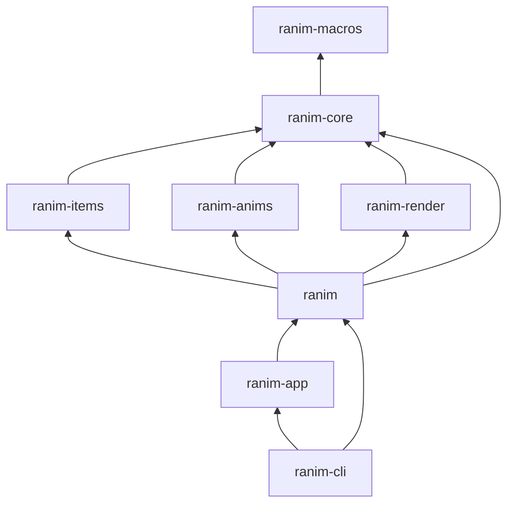

# Packages

```text
.
├── src/                        # ranim - 顶层 facade crate
├── packages/
│   ├── ranim-core/             # 核心动画引擎（时间线、组件、动画 trait）
│   ├── ranim-macros/           # proc-macro（#[scene]、#[output] 等）
│   ├── ranim-items/            # 内置可视元素（VItem、几何图形、SVG、文本）
│   ├── ranim-anims/            # 内置动画（淡入淡出、变形、书写等）
│   ├── ranim-render/           # GPU 渲染层（wgpu）
│   ├── ranim-app/              # 交互式预览应用（egui，支持 native/WASM）
│   └── ranim-cli/              # CLI 工具（渲染、预览、热加载）
├── example-packages/app/       # 示例应用
├── benches/                    # 性能基准测试
└── xtasks/xtask-examples/      # 示例构建自动化
```


