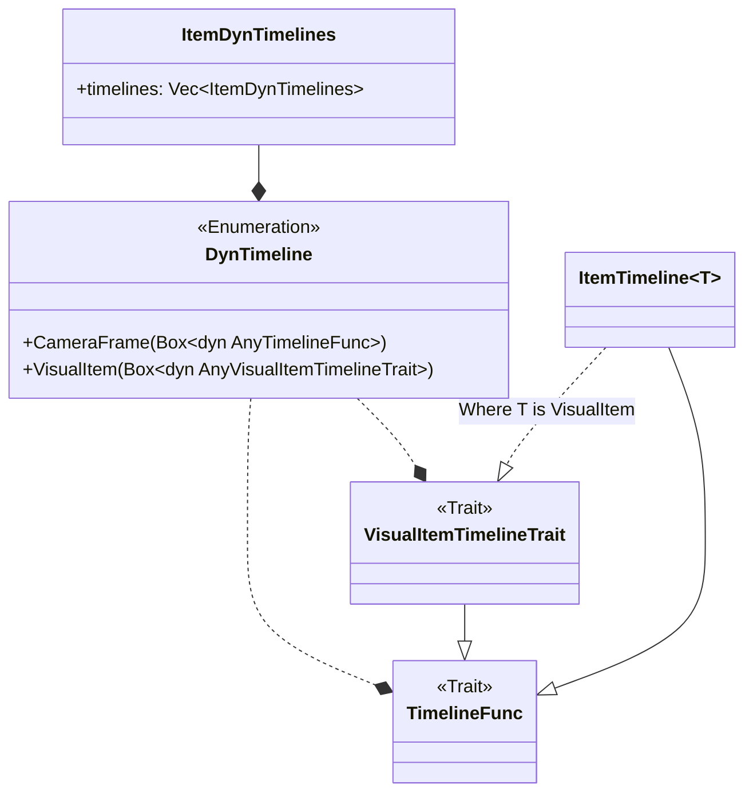

# 时间线

简单来说，时间线的本质是动画的容器，将若干动画以及其起止时间信息打包在一起也就得到了一条时间线。
一条时间线对应一个物件的全部动画，若干条时间线组合在一起即表示了整个场景的完整动画。

不过因为涉及泛型以及类型擦除，Ranim 的时间线封装并非简单的一层，而是很多层：



## `ItemTimeline<T>`

`ItemTimeline` 是第一层，它的本质就是一个动画的容器：

```rust,ignore
{{#include ../../../../src/timeline.rs:ItemTimeline}}
```

在编写动画时的一系列操作（如 `forward`、`play` 等）最后都会转变为对 `ItemTimeline` 内部属性的操作，
最终达成的结果就是在其 `anims` 属性中完成此条时间线所有动画以及其起止时间的编码（即“把动画在时间上放到正确的位置”）。

## DynTimeline

`DynTimeline` 是第二层，用于对 `ItemTimeline` 进行类型擦除：

```rust,ignore
{{#include ../../../../src/timeline.rs:DynTimeline}}
```

在场景中，我们会有多个物件，每个物件都有自己的时间线，为了能够遍历时间线进行求值等操作，必须要对时间线进行类型擦除，从而将不同物件的时间线放到一个容器中。

`AnyTimelineFunc` 就是 `Any + TimelineFunc`，带有基础的时间线操作，而 `AnyVisualItemTimelineTrait` 就是 `Any + VisualItemTimelineTrait`，在 `TimelineFunc` 的基础上额外多了 `eval_sec` 方法：

```rust,ignore
{{#include ../../../../src/timeline.rs:VisualItemTimelineTrait}}
```

这样，通过 `TimelineId<T>` 可以获取对应的 Timeline 并还原类型，而在求值、渲染时没有类型信息，直接使用 Trait 提供的方法进行求值。

## ItemDynTimelines

其实到 `DynTimeline` 已经足够了，但是为了支持“变更同一条 Timeline 的类型”，在 `DynTimeline` 的基础上又包了第三层：

```rust,ignore
{{#include ../../../../src/timeline.rs:ItemDynTimelines}}
```

简单来说，在实际操作的时候，永远操作的是最后一个 `DynTimeline`，这使得其表现得像是一个 `DynTimeline`，不过额外有一个 `apply_map` 方法，可以使用一个 `map_fn: impl FnOnce(T) -> E` 来使用最后一个 `DynTimeline` 的内部状态进行转换，然后再插入一个新的 `DynTimeline`。