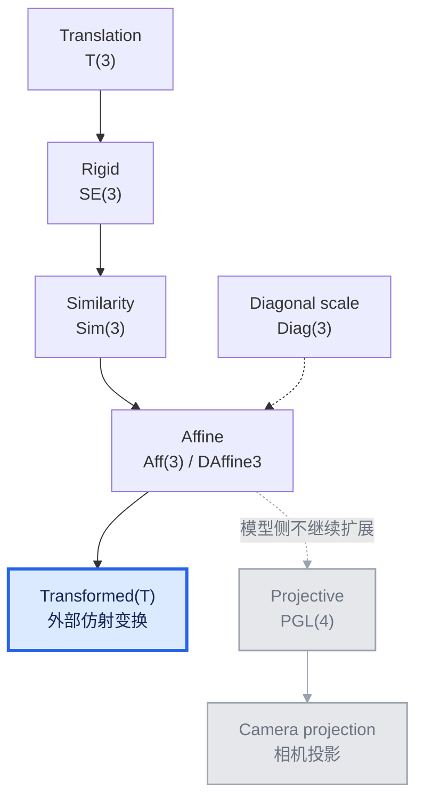
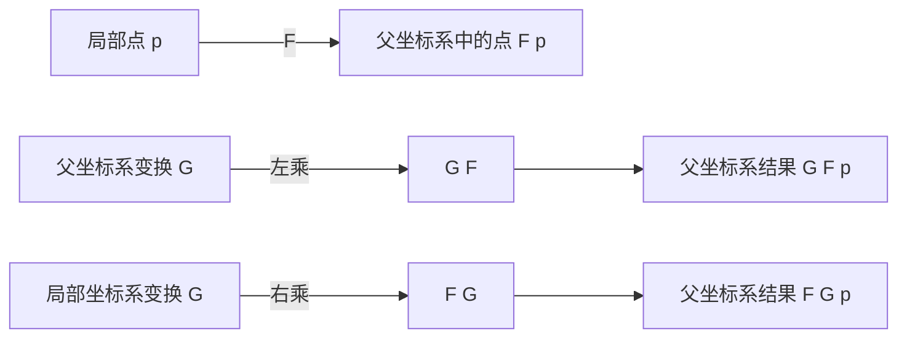
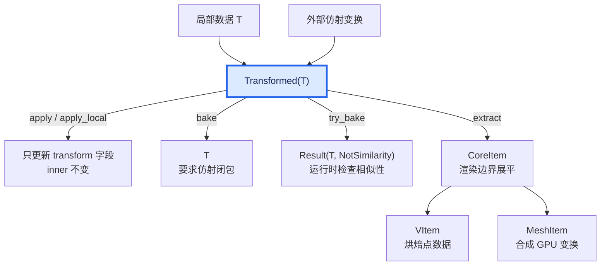

# `Transformed<T>`：变换、物件与 Erlangen 纲领

在 ranim 中，一个物件的形状数据和它在场景中的位置是两件不同的事。
例如，一个 `Rectangle` 可以始终保存为局部坐标中的矩形；它被旋转、缩放和
移动到场景中时，不必把这些操作立即写回矩形的参数。这个区分是
`Transformed<T>` 的出发点，也是 ranim 变换系统的核心。

本文先从 ranim 的实际 API 开始，然后用一张变换群的总图建立整体地图，最后
借助 Klein 在 1872 年提出的 Erlangen 纲领解释：为什么不同物件接受不同的
变换、为什么 `Transformed<T>` 可以容纳更一般的变换，以及为什么 `bake` 必须
有明确的边界。

## 1. ranim 中的变化如何应用

ranim 的基础变换接口是 `ApplyTransform<G>`：

```rust,ignore
pub trait ApplyTransform<G> {
    fn apply(&mut self, transform: G) -> &mut Self;
}
```

这里有两个类型参数的角色：

- `G` 是**变换元素**，例如 `Translation`、`Rigid`、`Similarity` 或 `Diag`；
- `Self` 是**被变换的物件**，例如 `VItem`、`Circle` 或 `Transformed<T>`。

因此，`ApplyTransform<G>` 不是“物件有一个叫 transform 的字段”，而是说：
“这个物件知道如何响应某一种变换”。同一个变换作用在不同物件上，响应方式
可以不同。

`shift`、`rotate`、`scale` 和 `scale_uniform` 是更方便的调用入口。它们不是
另一套变换规则，而是从 `ApplyTransform<G>` 自动派生出来的 façade：

```rust,ignore
// 平移需要 Translation
item.shift(offset);

// 旋转需要 Rigid
item.rotate_on_axis(axis, angle);

// 世界轴非均匀缩放需要 Diag
item.scale(scale);

// 均匀缩放需要 Similarity
item.scale_uniform(factor);
```

不同类型通过自己实现的 `ApplyTransform<G>` 范围声明其能够直接吸收什么：

```rust,ignore
// 点数据可以直接吸收任意仿射变换
impl<G: Into<DAffine3>> ApplyTransform<G> for VItem { /* ... */ }

// 圆只能直接吸收保持圆形语义的相似变换
impl<G: Into<Similarity>> ApplyTransform<G> for Circle { /* ... */ }
```

这会产生两种不同的使用方式：

1. **裸物件**：调用变换会立即修改物件自身的数据，因此必须满足该物件的
   语义约束。
2. **`Transformed<T>`**：调用变换只修改 wrapper 的 `transform` 字段，不触碰
   `inner`。这个字段表示从 `inner` 的局部坐标系到 wrapper 父坐标系的仿射映射；
   只有显式 `bake` 时，才检查该映射能否被重新吸收到 `T` 中。

例如，下面的操作不会改变 `rectangle` 的局部参数，而是把一个世界系变换
记录在 wrapper 中：

```rust,ignore
let mut rectangle = Transformed::new(Rectangle::new(...));
rectangle.rotate_on_axis(DVec3::Z, angle);
rectangle.scale(DVec3::new(2.0, 1.0, 1.0));
```

如果要沿矩形自身的局部轴操作，则使用局部作用：

```rust,ignore
rectangle.apply_local(Diag(DVec3::new(2.0, 1.0, 1.0)));
```

这两个操作看起来都像“缩放”，但它们的坐标系不同，结果也不同。理解这
一点需要先看 ranim 所支持的变换类型整体处在什么关系中。

## 2. 变换群总图：ranim 的 API 地图



可以把这张图当作 ranim 变换 API 的地图：

| ranim 类型 | 数学对象 | 能表达的变换 | 主要用途 |
|---|---|---|---|
| `Translation` | 平移群 `T(3)` | 位置变化 | `shift` |
| `Rigid` | 刚体群 `SE(3)` | 旋转 + 平移 | `rotate` |
| `Similarity` | 相似群 `Sim(3)` | 旋转 + 平移 + 均匀缩放 | 圆、球、矩形等语义物件 |
| `Diag` | 对角缩放集合 | 世界轴非均匀缩放 | 点数据及局部/世界轴缩放 |
| `DAffine3` | 仿射矩阵 | 非均匀缩放、剪切及其组合 | `Transformed` 的外部变换 |
| 射影矩阵 | `PGL(4)` | 透视和一般射影变换 | 仅相机投影 |

图中的箭头表示无损地嵌入到更一般的表示中。例如一个 `Similarity` 可以
转换为 `DAffine3`，但一般的 `DAffine3` 不能反过来恢复成 `Similarity`。
`Diag` 不是 `Similarity` 的下一层：它和旋转组合后通常会产生剪切，因此
直接进入仿射层。

## 3. Erlangen 纲领：用变换群定义几何

### 3.1 从“研究形状”到“研究不变量”

19 世纪几何学中，不同几何理论看起来在研究不同的对象：欧氏几何研究长度
和角度，射影几何研究透视下仍然保留的性质，仿射几何则介于两者之间。
Felix Klein 在 1872 年的 Erlangen 纲领中提出了一个统一的看法：

> 一种几何，就是选定一个变换群，并研究这个群作用下保持不变的性质。

这里的“群”是允许进行的变换集合；“不变量”是经过这些变换后仍然成立的
性质。这个观点并不要求我们先定义某种固定的形状，再问它能不能被变换；
恰恰相反，形状的语义本身就是由它所关心的不变量决定的。

在 ranim 中，可以把这个观点翻译成三层关系：

```text
变换群 G       ：允许哪些变换
群作用 G × X   ：这些变换如何作用于物件集合 X
不变量         ：作用前后仍然成立的物件性质
```

`ApplyTransform<G>` 表达第二层，物件类型的实现和参数表达表达第三层，而
`Translation`、`Rigid`、`Similarity`、`Affine` 则提供第一层的不同选择。

### 3.2 群越大，不变量越少

在三维空间中，常见的几何层级可以这样理解：

| 变换层级 | 主要保持的性质 | 典型物件语义 |
|---|---|---|
| 刚体 `SE(3)` | 长度、角度、面积、体积、手性 | 任意形状的摆放 |
| 相似 `Sim(3)` | 角度、长度比、形状比例 | 圆、球、正方形、圆弧 |
| 仿射 `Aff(3)` | 共线、平行、仿射组合、凸性 | 点集、三角形、平行四边形 |
| 射影 `PGL(4)` | 关联性、交比 | 透视投影、射影曲线 |

从上往下，允许的变换越来越一般，保留下来的性质越来越少：

- 刚体变换不会改变任何形状的长度和角度；
- 均匀缩放会改变绝对长度，但不会改变角度和长度比例；
- 一般仿射变换会把圆变成椭圆、矩形变成平行四边形，但仍保持直线、平行
  关系和中点等仿射性质；
- 射影变换甚至可以让平行线相交于消失点，中点和长度也不再有意义。

这正是 ranim 不能给所有类型都提供同一个 `scale` 的原因：不同类型选择了
不同的形状不变量，也就选择了不同的最大变换群。

## 4. 为什么总图是这条层级

### 4.1 齐次坐标和仿射矩阵

仿射变换可以写成：

$$
p' = A p + t
$$

其中 `A` 是线性部分，`t` 是平移部分。由于平移使它不再是普通的线性
映射，我们把点提升到齐次坐标：

$$
tilde(p) = mat(p; 1),
quad
M = mat(A, t; 0^T, 1) "。"
$$

在这个表示中，组合就是矩阵乘法：

$$
M_2 M_1 p
quad "表示先应用 " M_1 "，再应用 " M_2 "。"
$$

`DAffine3` 正是这个仿射矩阵的类型表示。它的齐次末行固定为
`(0, 0, 0, 1)`，因此作用在模型数据上的变换始终满足 `p' = A p + t`，不需要
进行透视除法。

### 4.2 平移、刚体和相似变换

平移的线性部分是单位矩阵 `I`，只改变位置。旋转矩阵 `R` 满足：

$$
R^T R = I, quad det R = 1 "。"
$$

因此它保持长度和角度。旋转加平移构成刚体群 `SE(3)`：

$$
M = mat(R, t; 0^T, 1) "。"
$$

如果再加入正的均匀缩放 `s`，线性部分变为 `sR`，得到相似变换：

$$
M = mat(s R, t; 0^T, 1) "。"
$$

所有长度同时乘以 `s`，所以角度和长度比例保持不变。圆经过相似变换后
仍是圆，半径只需要乘以 `s`；这就是 `Circle` 和 `Sphere` 可以接受
`Similarity` 的数学原因。

### 4.3 非均匀缩放为什么进入仿射层

世界轴非均匀缩放的线性部分是：

$$
D = op("diag")(s_x, s_y, s_z) "。"
$$

`D` 自身可以表达非均匀缩放，但它和旋转并不形成一个只含“旋转加对角缩放”
的封闭系统。一般来说：

$$
R_1 D R_2
in.not {R D} "。"
$$

结果可能带有非对角项，也就是剪切。于是，一个旋转后的矩形再接受世界轴
非均匀缩放，通常不再是矩形，而是平行四边形。

这不是 ranim API 的偶然限制，而是群结构的限制：非均匀缩放应该被提升到
`Affine`，而不是被伪装成 `Similarity`。

### 4.4 为什么模型变换停在仿射

一般射影矩阵的齐次末行不再固定。点变换后得到：

$$
(x, y, z, 1) mapsto (x', y', z', w'),
quad
p' = (frac(x', w'), frac(y', w'), frac(z', w')) "。"
$$

这次齐次除法正是透视近大远小的来源。射影变换仍然保持直线，但会破坏
平行性、中点和长度关系；普通 Bézier 控制点逐点变换后，也不再代表原曲线
的射影像。

因此 ranim 将两个阶段分开：

- 模型和场景侧使用 `DAffine3`，保持仿射几何的基础设施有效；
- 相机投影侧才使用射影矩阵，由渲染管线在最后阶段进行透视除法。

`DMat4` 在容量上可以装下射影矩阵，但 `Transformed` 使用 `DAffine3` 是
有意的类型边界：模型路径不接受射影变换。

## 5. `ApplyTransform<G>` 是群作用

现在可以精确定义 `ApplyTransform<G>` 的数学含义。给定一个变换群 `G` 和
一组物件 `X`，群作用是：

$$
G times X arrow.r.long X,
quad (g, x) mapsto g dot x "。"
$$

它至少需要满足两个行为：

$$
e dot x = x,
quad
(g_2 g_1) dot x = g_2 dot (g_1 dot x) "。"
$$

第一条表示单位变换不改变物件，第二条表示组合变换的顺序与分别应用相同。
这就是为什么变换组合应由矩阵乘法统一处理，而不应为每一种“平移后旋转
再缩放”的组合分别发明规则。

但群作用并不意味着所有物件都用同一个公式：

- 点使用 `p' = A p + t`；
- 方向向量使用 `v' = Av`，不受平移影响；
- 法线使用逆转置，以保持与切向量的垂直关系；
- `Circle` 只在结果仍能表示为圆时更新圆心和半径；
- `VItem` 则可以逐点吸收一般仿射变换。

所以 `G` 描述“变换是什么”，`Self` 的 `ApplyTransform<G>` 实现描述“物件
如何响应”。这两个概念分开后，闭包约束自然落在 trait bound 上，而不是
散落在 `shift`、`rotate`、`scale` 的各个实现里。

## 6. `Transformed<T>`：把外部仿射变换与物件语义分开

`Transformed<T>` 的定义很简单：

```rust,ignore
pub struct Transformed<T> {
    pub transform: DAffine3, // inner 的局部坐标到父坐标系
    pub inner: T,             // 保持自身语义的局部物件
}
```

它的核心语义可以写成：

$$
op("visual")(op("Transformed")(T, F))
= F dot op("visual")(T) "。"
$$

`F` 表示从 `inner` 的局部坐标系到当前 wrapper 父坐标系的仿射映射；最外层
wrapper 的父坐标系通常就是世界坐标系。`F` 只改变视觉结果的放置方式，并不
要求 `F · T` 仍能写成同一种参数化类型。于是：

```text
Transformed<Rectangle>
    inner 仍然是 Rectangle
    transform 可以包含仿射剪切
    extract 后的视觉结果可以是平行四边形
```

这就是 wrapper 的“装箱”语义。它不会把一个平行四边形伪装成裸
`Rectangle`，而是明确保留两层事实：内部参数仍描述矩形，外部另有一个仿射
变换决定最终的视觉结果。

### 6.1 父坐标系与局部坐标系

设 `F` 是当前 wrapper 的局部到父级变换，`G` 是新变换：

- 父坐标系操作：`F' = G F`，也就是左乘；最外层对应世界系操作；
- 局部坐标系操作：`F' = F G`，也就是右乘。



假设矩形已经绕 Z 轴旋转。对它使用 `apply_local(Diag(...))`，表示沿矩形
自己的局部边缩放；对最外层 wrapper 使用 `scale(DVec3)`，则表示沿世界轴
缩放，结果可能包含剪切。

`Rectangle::scale_local` 是另一种操作：它直接修改矩形自身的局部尺寸参数，
属于物件的参数编辑；`Transformed::apply_local` 则把变换右乘到 wrapper 的
`transform` 字段。前者改变 `inner`，后者不改变 `inner`。两者都不应该被
解释为把世界轴投影到局部轴后再强行恢复成矩形。

嵌套 wrapper 按同样的规则组合：

```text
Transformed { t1, inner: Transformed { t2, inner: x } }

局部到最外层父级的合成变换 = t1 * t2
```

## 7. 闭包群决定什么时候可以 bake

从 Erlangen 纲领的角度看，一个物件类型对应一个形状族。它的**闭包群**是
能够作用在这个形状族上、并且让结果仍然可以无损表示为同一类型的最大变换群。

这解释了几种常见物件的差异：

| 物件 | 关键语义 | 当前可直接 bake 的范围 |
|---|---|---|
| 点、点集、`VItem` | 顶点数据 | 仿射 `DAffine3` |
| `Parallelogram` | 原点 + 两条一般边向量 | 仿射 `DAffine3` |
| `Circle` / `Sphere` | 等距半径、角度 | 相似 `Similarity` |
| `Rectangle` / `Square` | 相邻边正交 | 相似 `Similarity` |
| `Ellipse` | 数学上是二次型 | 数学上仿射；当前表示暂限相似 |

例如，仿射变换会把圆变成椭圆，所以它不能无损 bake 回 `{center, radius}`
形式的 `Circle`。而平行四边形由一般边向量表达，仿射变换后仍然可以用
两条一般边向量表达，因此可以接受 `DAffine3`。

椭圆本身在数学上属于仿射闭包；但 ranim 当前的 `Ellipse` / `EllipticArc`
使用“正交 axes + 半径”的存储方式。一般仿射变换后，主轴需要重新分解，
这个表示不能无损保留结果。因此当前实现暂时只为它提供 `Similarity` 闭包；
未来若改用二次型矩阵，才能开放完整的仿射 bake。

### 7.1 三条不同的路径

`Transformed<T>` 的外部变换、bake 和 extract 是三个不同阶段：



- 普通 `apply`、`shift`、`rotate` 和 `scale` 只复合 `transform` 字段，不会
  偷偷修改 `inner`；
- `bake()` 明确要求 `T` 能吸收一般仿射变换；
- `try_bake()` 用于圆、球、矩形等相似闭包物件；若外部变换含有非均匀缩放、
  剪切或反射，就返回 `NotSimilarity`；
- `extract()` 是渲染边界的展平。它不要求高层 `T` 仍然能表示变换后的语义，
  而是把视觉结果转换为 `CoreItem`。

对于 `MeshItem`，wrapper 的外部变换会与其渲染变换合成，再由 GPU 在顶点阶段
应用；对于 `VItem`，外部变换会直接烘焙进点数据。`Aabb` 也不能简单只变换
min/max 两点，而是要变换内部包围盒的八个角点后重新取包围盒。

## 8. 动画与变换量的区别

`Transformed<T>` 的插值按预期分成两部分：

```rust,ignore
Self {
    transform: self.transform.lerp(&target.transform, t),
    inner: self.inner.lerp(&target.inner, t),
}
```

这意味着 `transform` 字段和 `inner` 分别插值，而不是先把两个结果都烘焙成
世界点再做 morph。对于 perspective blend 等场景，不同面上原本处于同一个
世界位置的点可能沿不同路径插值；这是 wrapper 语义的自然结果。如果需要按
原始点数据进行 morph，应先把变换 bake 到 `VItem` 等底层点数据，再插值这些
数据。

变换不同几何量时还要区分它们的类型。令仿射线性部分为 `A`，平移为 `t`：

- 点：`p' = A p + t`；
- 方向/切向量：`v' = A v`；
- 法线：`n' = A⁻ᵀ n`。

法线使用逆转置，是因为它必须继续满足 `n · v = 0`：

$$
(A^(-T) n) dot (A v) = n dot v "。"
$$

因此法线不能在一般非均匀缩放下简单使用顶点的变换公式。

## 9. 回到最初的问题

ranim 的变换系统可以用一条线索贯穿起来：

- `Translation`、`Rigid`、`Similarity`、`Diag` 和 `DAffine3` 是不同精度的
  变换元素；
- `ApplyTransform<G>` 描述一个变换群如何作用于某种物件；
- Erlangen 纲领告诉我们，物件语义就是它在某个变换群下保留的不变量；
- 闭包群因此决定裸物件可以把哪些变换 bake 回自身；
- `Transformed<T>` 在物件外保存局部到父级的仿射变换，允许暂时表达超出 `T`
  闭包群的视觉结果，同时不破坏 `T` 的内部语义；
- `extract()` 在渲染边界展平视觉结果，`bake()` 则必须由用户明确要求；
- 模型变换停在仿射层，射影变换留给相机投影。

这样，变换 API、物件类型和数学上的几何层级不是三套互不相干的概念，而是
同一个设计在代码、视觉表示和几何理论中的三个侧面。
