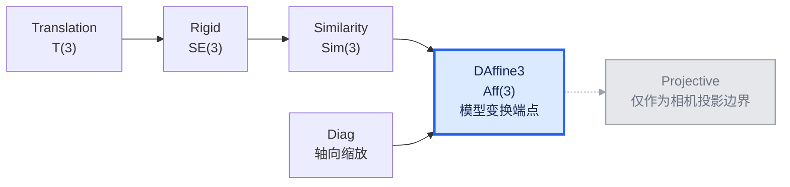

# `Transformed<T, G>`：变换表示、组合与物件语义

> [!caution]
> ai 生成，可能叙事逻辑和表述并不是很好，仅供参考。

ranim 把“物件自身的数据”和“附加在物件外的变换”分开表达：

```rust,ignore
pub struct Transformed<T, G> {
    pub inner: T,
    pub transform: G,
}
```

`T` 是物件，`G` 是 wrapper **实际存储的变换表示**。字段保持公开，可以在
自定义 evaluator 中直接读写；常规组合则推荐使用 `compose_outer` 和
`compose_inner`，使乘法顺序一目了然。

## 1. 变换类型与仿射端点

ranim 的模型变换层级如下：



- `Translation`：纯平移；
- `Rigid`：旋转和平移；
- `Similarity`：正的均匀缩放、旋转和平移；
- `Diag`：沿坐标轴缩放，它不属于 `Similarity`；
- `DAffine3`：模型变换的最一般表示，可以表达剪切和一般仿射组合；
- projective 不是模型变换的下一种存储类型，只存在于相机投影边界。

图中的实线箭头对应无损的 `From` 嵌入。`From` 在 Rust 中不传递，因此 ranim
显式提供已有层级中的全部转换：

```text
Translation -> Rigid / Similarity / DAffine3
Rigid       -> Similarity / DAffine3
Similarity  -> DAffine3
Diag        -> DAffine3
```

每个表示都实现同一个 `TransformGroup` 能力，提供单位元和同族组合。组合顺序与
仿射矩阵一致：

$$
op("compose")(g_2, g_1) = g_2 g_1
$$

也就是先作用 $g_1$，再作用 $g_2$。`Similarity` 组合时，外层的缩放和旋转也会
作用于内层平移；它不是把三个字段分别相加。

`Diag` 仍保留当前数值行为，包括零缩放。这里没有额外引入“严格可逆”的运行时
检查。

## 2. `ApplyTransform<G>`：物件能直接吸收什么

基础接口是：

```rust,ignore
pub trait ApplyTransform<G> {
    fn apply(&mut self, transform: G) -> &mut Self;
}
```

物件通过实现范围声明自己的闭包：

```rust,ignore
// 点数据可以吸收仿射变换及其子类型
impl<G: Into<DAffine3>> ApplyTransform<G> for VItem { /* ... */ }

// 点集/网格数据可以吸收仿射变换
// canonical Circle、Ellipse、Rectangle、Square、Sphere 不直接吸收 placement
```

便利操作由这个接口派生：

| 操作 | 提交给 `ApplyTransform` 的类型 |
|---|---|
| `shift(offset)` | `Translation` |
| `rotate_on_axis(axis, angle)` | `Rigid` |
| `scale_uniform(s)` | `Similarity` |
| `scale(DVec3)` | `Diag` |

canonical `Rectangle`、`Circle`、`Sphere` 等不直接实现 `ApplyTransform`；它们的
平移、旋转和缩放都应通过 `Transformed<T, G>` 表达。`Rectangle::scale_axes` 是单独的
内在尺寸编辑。点集型 `VItem`、`Polygon`、`Line`、`MeshItem` 和 `Surface` 才直接
吸收一般仿射 `DAffine3`。

## 3. 构造 wrapper：参数就是精确的 `G`

构造器同时接收物件与变换：

```rust,ignore
let item = Transformed::new(mesh, DAffine3::IDENTITY);
```

prelude 还导出了 blanket extension trait，可以写成：

```rust,ignore
let item = mesh.transformed::<DAffine3>(DAffine3::IDENTITY);
```

`.transformed::<G>(g)` 的参数必须恰好是 `G`；这个入口不会替调用者选择更宽的
存储类型。通常可以让类型推断直接从参数得到 `G`：

```rust,ignore
let item = mesh.transformed(Translation(offset));
// 类型是 Transformed<MeshItem, Translation>
```

选择较窄的 `G` 会让可组合的操作在编译期受限；选择 `DAffine3` 则是现有
mesh/surface 场景常用的存储上界。

## 4. outer 与 inner 组合

设 wrapper 当前存储 $F$，新变换为 $H$。两种组合只有乘法方向不同：

$$
F_("outer")' = H F
$$

$$
F_("inner")' = F H
$$

对应 API：

```rust,ignore
item.compose_outer(h); // transform = h * transform
item.compose_inner(h); // transform = transform * h
```

`ApplyTransform<H> for Transformed<T, G>` 使用 **outer composition**，所以
`shift`、`rotate`、`scale_uniform` 和 `scale` 在可用时也都走左乘：

```rust,ignore
item.apply(h); // 等价于 item.compose_outer(h)
```

`compose_outer` 与 `compose_inner` 都要求 `G: From<H>`，先把 `H` 嵌入现有的
`G`，再在 `G` 内完成同族组合。它们不会创建新的 wrapper 类型。

### 4.1 不自动 widening，也不计算 join

下面的 wrapper 保持 `Similarity` 存储：

```rust,ignore
let mut item = sphere.transformed(Similarity::IDENTITY);
item.shift(offset);        // Translation -> Similarity
item.scale_uniform(2.0);   // 仍是 Transformed<Sphere, Similarity>
```

但一般 `Diag` 不能嵌入 `Similarity`，因此 `item.scale(non_uniform)` 不会偷偷把
类型改成 `Transformed<_, DAffine3>`，而是在编译期不可用。需要更一般的组合时，
显式 widening：

```rust,ignore
let narrow = mesh.transformed(Translation(offset));
let mut affine: Transformed<_, DAffine3> = narrow.into();
affine.scale(DVec3::new(2.0, 1.0, 1.0));
```

这种显式 `Into` 让 API 的返回类型稳定，也避免为任意两种变换表示自动推导
“最小共同上界”所带来的 coherence 问题。

### 4.2 嵌套 wrapper

嵌套依然从内向外展平：

```text
Transformed {
    transform: outer,
    inner: Transformed {
        transform: inner,
        inner: x,
    },
}

最终组合 = outer * inner
```

## 5. bake 是编译期能力

`bake` 的签名直接使用 wrapper 的 `G`：

```rust,ignore
pub fn bake(self) -> T
where
    T: ApplyTransform<G>;
```

所以它是否存在完全由类型系统决定：

```rust,ignore
let polygon = Polygon::new(points)
    .transformed(DAffine3::from_scale(...))
    .bake(); // Polygon: ApplyTransform<DAffine3>

let circle = Circle::new(1.0).transformed(Similarity::IDENTITY);
// circle.bake(); // 编译失败：Circle 不吸收 placement；保留 wrapper
```

wrapper 不再提供 `try_bake`。如果调用者确实需要把动态得到的 `DAffine3` 向下
检查为 `Similarity`，应先显式执行 `Similarity::try_from(affine)`，然后构造
`Transformed<T, Similarity>`；成功后 `bake` 仍然是静态能力。

这与几何闭包相符：

| 物件表示 | 可直接吸收的上界 |
|---|---|
| 点、点集、`VItem`、一般 mesh 点数据 | `DAffine3` |
| `Parallelogram` | `DAffine3` |
| `Polygon` / `Line` / `VItem` / `MeshItem` / `Surface` | `DAffine3` |
| `Parallelogram` / `ArcBetweenPoints` | `DAffine3` / `Similarity`（按实现） |
| canonical `Circle` / `Ellipse` / `EllipticArc` / `Sphere` / `Rectangle` / `Square` | 不直接 bake placement |

一般仿射变换会把圆变成椭圆、把矩形变成平行四边形，因此不能无损地 bake 回
原来的参数化类型。

## 6. anchor、extract、Aabb 与几何边界

anchor 的语义首先属于 `inner` 的 local space：`Locate` 实现先在内部物件上
定位，再把所得点通过 `G -> DAffine3` 变换到 wrapper 的外部空间。当前 wrapper
提供这种 forwarding 的是 core 的 `Centroid`，以及 geometry primitive 的
`Origin` / `Focus`；不存在一个无冲突的任意 anchor blanket impl（`DVec3` 已经
对所有 target 实现 `Locate`）。因此，未列出的 anchor 仍只对它直接支持的
`inner` 类型生效，不能假定任意 `Locate<A>` 都会自动穿过 wrapper。

`Transformed<T, G>` 不要求 `T: ApplyTransform<G>` 就能 extract。只要 `G` 能
转换为 `DAffine3`，wrapper 会在几何边界进行一次转换：

```text
G --Into<DAffine3>--> CoreItem / Aabb geometry
```

- `VItem`：仿射变换烘焙到点，法线使用逆转置；
- core `MeshItem`：仿射矩阵左乘已有渲染矩阵，顶点保持不变；
- `Aabb`：变换内部包围盒的八个角点，再重新取界。

这使高层物件可以保留语义表示，同时渲染结果仍能包含更一般的仿射效果。
`DAffine3` 是这里的端点；不会继续转换到 projective 模型矩阵。

### 6.1 local primitive、一般 local data 与 placement

canonical local primitive（例如以原点为中心的 `Circle`、`Rectangle`、`Sphere`）
把形状参数和 local 坐标约定写在自身类型中。一般 local data（`VItem` 点集、
`Surface` 顶点等）则只是调用者提供的坐标；两者都**不会自动中心化**。需要把
物件放到场景中时，使用 `Transformed` 的外部 `transform`，不要把外部 placement
误当成 primitive 的 intrinsic 参数。

`Rectangle::scale_axes` 例外也不是 placement：它是 intrinsic shape-data
操作，沿 Rectangle 已有的 canonical/intrinsic axes 修改尺寸。wrapper 的
`compose_outer` / `compose_inner` 才是外部变换组合。

`Sphere -> Surface` 只负责把 Sphere 的 canonical local 参数采样成顶点，
`Surface` 不会再次 center；这样可避免重复 center。`bake` 是明确的边界操作：
只有当 `T: ApplyTransform<G>` 时才把外部变换吸收到 `inner`，否则继续保留
wrapper，并在 extract 时于几何边界转换为 `DAffine3`。

## 7. 插值

只有两个 wrapper 的 `T` 与 `G` 都相同时才能直接插值：

```rust,ignore
Self {
    inner: self.inner.lerp(&target.inner, t),
    transform: self.transform.lerp(&target.transform, t),
}
```

`inner` 与 `transform` 独立插值，不会先展平为点数据。若两端 wrapper 使用不同
存储类型，应先由调用者把它们显式 widening 到同一个 `G`。

### 7.1 wrapper 插值与 bake 插值是两种预期行为

wrapper 的独立插值意味着：同一点集在不同放置下的过渡**始终保留各自的局部
形状**，运动发生在 `transform` 上。例如两个仅放置不同的方块（inner 完全相同，
变换分别放在 XY 平面与 XZ 平面上），中间帧不会出现“一个平面翻到另一个平面”
的点级渐变——每个点在局部空间里静止不动，位姿由矩阵插值承载。这是预期行为，
不是缺陷。

如果需要的是经典 manim 式的形态 morph——逐点在世界空间中走直线、法线和平面
随顶点一起形变——就把两端的放置 **bake 进底层数据**再插值：转成裸 `VItem`
或 `MeshItem` 后，插值就是纯底层点插值。两种模式由表示方式显式选择：

| 模式 | 表示 | 插值路径 |
|---|---|---|
| 位姿插值 | `Transformed<T, G>` | inner 恒定（或各自插值），`G` 独立插值 |
| 形态 morph | 裸 `VItem` / `MeshItem`（已 bake） | 全部控制点世界空间逐点插值 |

`G` 的选择决定位姿插值的路径质量：`Translation` 是线性位移；
`Rigid` 用 slerp 旋转 + lerp 平移，刚体位姿全程保持刚性；`DAffine3` 及
`Mat4` 存储是逐分量线性混合，大角度旋转的中间帧可能出现轻微收缩，
此时应改用 `Rigid` 存储，或按需 bake。

## 8. `Rectangle::scale_axes` 与 wrapper 组合

`Rectangle::scale_axes(DVec2)` 是**形状参数编辑**：它只修改 `size`，尺寸沿
矩形已经存储的两条正交 shape axes 解释。矩形即使先旋转过，调用
`scale_axes` 后仍保留这组旋转后的正交轴表示。

它不同于 wrapper 组合：

```rust,ignore
rectangle.scale_axes(dvec2(2.0, 0.5));
// 修改 Rectangle 的维度参数

wrapped.compose_inner(Diag(dvec3(2.0, 0.5, 1.0)));
// inner 不变，右乘 wrapper.transform

wrapped.compose_outer(Diag(dvec3(2.0, 0.5, 1.0)));
// inner 不变，左乘 wrapper.transform
```

不要把 `scale_axes` 理解为矩阵乘法的别名：前者维护 `Rectangle` 的正交参数化
表示，后两者维护 wrapper 的组合顺序。

## 9. 几何视角

Klein 的 Erlangen 纲领把一种几何理解为“研究某个变换群下的不变量”。在
ranim 中：

- `G` 描述允许组合的变换；
- `ApplyTransform<G>` 描述物件表示对这个群是否闭包；
- `Transformed<T, G>` 把外部组合与 `T` 的参数化语义分离；
- `bake` 在编译期重新要求闭包；
- `extract` 在仿射几何端点生成最终视觉数据。

这个分层让变换的数学顺序、Rust 类型与物件几何语义保持一致。
