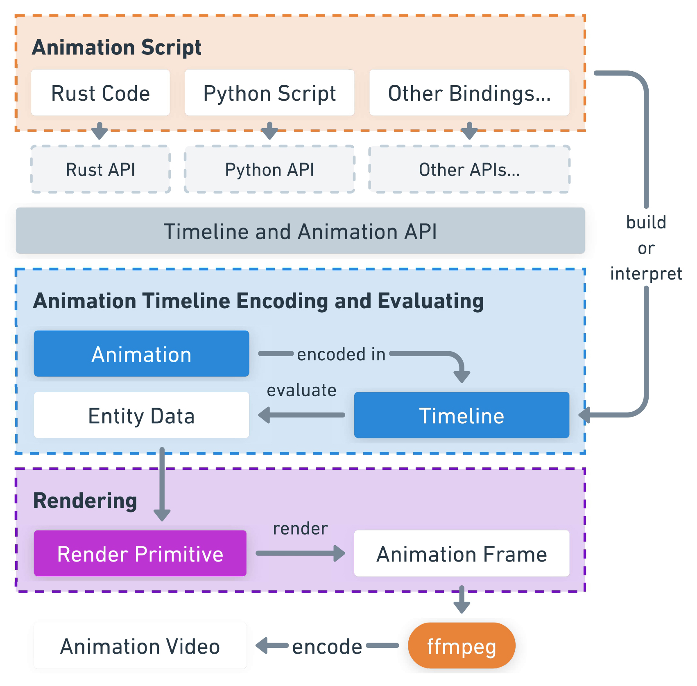

+++
title = "架构"
insert_anchor_links = "right"
+++

## 架构图

## 预编码动画

Ranim 使用一个 Timeline 结构来进行动画的预编码。每一个实体有自己的 Id，同一个实体可能在动画的不同阶段具有不同的类型、不同的数据。每一个 Id 的实体拥有一条自己的 EntityTimeline，在其中，该 Id 的相同的类型共享同一个 RenderInstance